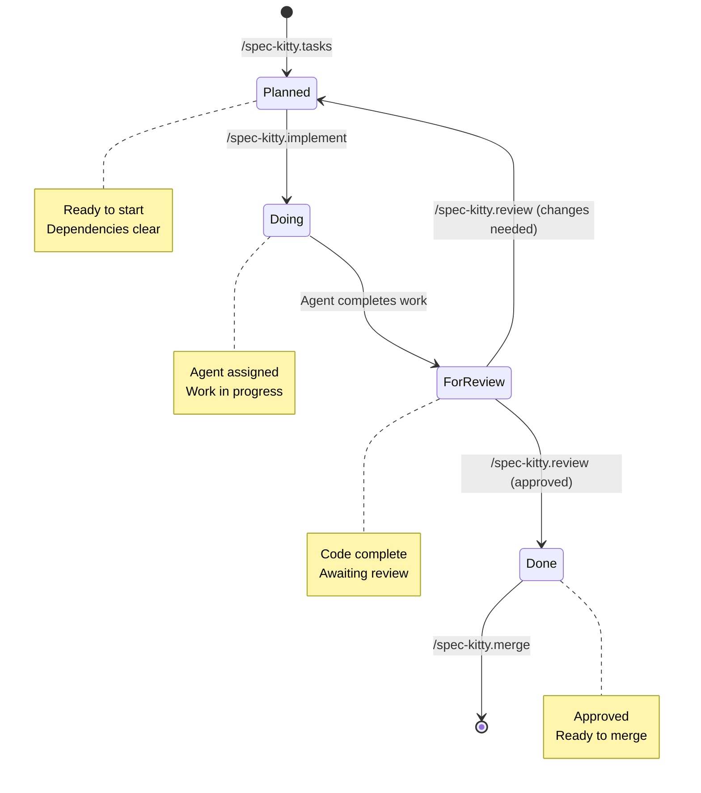

在日常开发、使用电脑的过程中，遇见的很多问题都可以使用 Claude Code 解决，只要是终端命令后能触达的地方都可以。例如：
* 软件编程开发，可以编写单个模块、工具函数、单元测试、修复BUG。甚至可以在一个空文件夹中，仅通过与 Claude Code 对话，
就能创建出一个可用的网页项目，也能直接部署到本地 docker 中。
* 安装软件、开发环境、配置环境变量、shell 环境等
* 使用 shell 命令处理磁盘文件、查找应用进程、分析内存使用等等

在不对 Claude Code 做任何增强的情况下，它用于解决事情的[默认的工具](https://code.claude.com/docs/en/how-claude-code-works#tools)
包含但不限于：Claude Code 内置的提示词与指令、文件系统、网络与文档检索工具、shell 与 cli 命令，
在部分情况下 Claude Code 会通过使用编程语言（通常是 Python、Nodejs、Shell）创建临时脚本来解决问题。

Skills 对 Claude Code 来说，就像“处理某专一事的指南”。
[Anthropic Claude Skills 指南](https://gist.github.com/liskl/269ae33835ab4bfdd6140f0beb909873)

## Skills 设计

在初次接触 Tailwind CSS 的时候，了解到一种设计方式：“原子化设计”，
即将 CSS 样式拆解成不可再分的最小颗粒度单位，并为每个单位定义一个唯一的类名。这些原子类名可以组合形成任意想要的样式。
使得开发者不需要耗费心力在 className 名称定义与样式文件的组织上，直接在 className 中编写具体的样式描述原子类即可。
例如：`className="w-full bg-red-200 text-while"`

那么 skills 是否也可以使用原子化的设计方式。

假设我现在需要设计一个 OMS 项目的”React组件规范“的 skill。我可以选择直接创建一个 react-component 的 skill：(非常随意的一个demo)
```markdown
---
name: React组件规范
description: 创建新的 React 组件、修改 React 组件、审查 React 组件是否符合规范。当用户希望创建新的、修改、优化、审查 React 组件时使用。
---

# Overview  概述
使用现代模式（包括函数式组件、钩子、组合和用于类型安全的 TypeScript）构建可扩展、可维护的 React 组件。

# 使用时机
* 创建新的 React 组件
* 修改 React 组件
* 审查 React 组件
* 优化 React 组件

# 组件规范
* 使用 TypeScript 保证类型安全
* 组件 props 属性验证
* 保持组件单一用途
* 使用 函数式组件 与 hooks
* 使用组合而非继承
* 高计算成本的状态应用
* 提取自定义钩子以实现可重用逻辑
* 组件、props 字段需要 jsDoc 注释
* 组件样式编写优先级：tailwindCSS > less modules > style。动画等复杂场景优先使用 less modules
...  

# 生成流程
1. 确认组件信息
    * 组件名称（PascalCase）
    * 组件类型（基础组件、容器组件、页面组件）
    * 所需 props
2. 创建文件结构
\```txt
src/components/{ComponentName}/
├── index.tsx // 组件文件
└── index.modules.less // 组件样式文件，可选
生成组件文件
/```
3. 实现组件
....
  
# `Button` 组件的定义示例
\```ts
// Button.tsx
import React, { useState, useCallback } from 'react';

export interface ButtonProps {
 ...
}

/**
 * 按钮组件
 * ...
 */
export default function Button (props: ButtonProps) {
  const { ... } = props;
  return (...);
};
\```

# 相关资源
skill resources 中的相关规范内容...

```
给 Agent 安装上述 skill 时，在让它执行新建组件任务的时候，就会匹配到上述 skill 的 `description`，就会将完整的 skill 内容载入到 Agent 的上下文中。
从而让 Agent 写出符合规范的组件代码。

从上面的“React组件规范”可以看出，开发一个组件设计的规范中包含很多细分可独立的规范，有一些是可以独立于当前项目的，在整个前端项目中使用。

例如：
* “使用 TypeScript 保证类型安全”。那么这里就涉及到 TypeScript 规范（interface\type\enume\范型等规范）。
* “组件、props 字段需要 jsDoc 注释”，这里就包含了 jsDoc 的编写规范（类、函数、字段、成员变量、全局变量、静态变量...）
* “使用 函数式组件 与 hooks” 与 “使用组合而非继承” 就包含了 函数式组件规范、 hook编写规范
* “组件样式编写优先级：TailwindCSS > less modules > style。动画等复杂场景优先使用 less modules” 包含了 CSS样式规范、CSS动画规范（transform优先等等）、TailwindCSS 规范（className原子类名排序等）
* ...

根据上面的分析可以发现很多细拆的规范是可以在不同项目中使用的：
* TypeScript 规范：H5、小程序、React Native
* jsDoc 的编写规范：H5、小程序、React Native
* 函数式组件规范：H5、小程序、React Native
* hook编写规范：H5、小程序、React Native
* CSS样式规范：H5、小程序
* CSS动画规范：H5、小程序
* TailwindCSS 规范：H5、小程序

假设这些规范都已经准备就绪，那么就可以在“React组件规范”中引用这些规范。这样有如下好处：
* 不需要重复编写基础的 Skills 描述
* 多个项目中让 Agent 写出风格一样或类似的代码，团队 Agent 代码风格统一。
* 团队、项目的 Skills 职责清晰、可维护

将单个 Skill 按照最小职责的原则设计，在新的 Skill 中引用其他的 Skill。按原子化思想为团队、项目构建专属的 Skills Git 仓库。

将 Skills 发布到 Git 仓库，通过 [skills](https://github.com/vercel-labs/skills) 这个工具安装到具体的项目中。
另外还可以通过这个工具检查已安装的 Skills 是否有更新并更新。此工具支持市面上常见的 Agent 的 Skills 安装配置。

## 让 Agent 获取需求相关文档

通常在项目中开发人员在开发一个需求前需要熟悉的文件包含但不限于：
* 飞书的需求描述文档：需求功能描述、需求流程图、需求中的字段规格与约束描述...
* 蓝湖原型图 或 Figma 设计稿
* 测试用例的脑图 xmind 文件

现在是让 Agent 完成需求的开发工作，那么如何让 Agent 读取并理解这些文档呢？
你可以选择手动将其都复制到特定的提示词 Markdown 文件中，UI 则用截图的方式。
都搜集好后，再与需求的提示词一起投喂给 AI。

也可以借助 MCP 与 Skills 让 Agent 自动去读取这些文档。开发者只需要在需求的提示词中包含这些文档的链接即可。
* 飞书的需求文档：[lark-openapi-mcp](https://github.com/larksuite/lark-openapi-mcp) 这是飞书官方的 Agent MCP 服务（不支持读取电子表格，社区有方案）。
```json
{
  "mcpServers": {
    "lark-mcp": {
      "command": "npx",
      "args": [
        "-y",
        "@larksuiteoapi/lark-mcp",
        "mcp",
        "-a",
        "自建应用的唯一标识",
        "-s",
        "自建应用的密钥"
      ]
    }
  }
}
```
* 蓝湖：官方的MCP好像好像开发中：https://lanhumcp.com/ ，这种情况下 Github 社区中就会随机刷新一位大佬 [lanhu-mcp](https://github.com/dsphper/lanhu-mcp)
* Figma：使用官方提供的 MCP 服务 [remote-server](https://developers.figma.com/docs/figma-mcp-server/remote-server-installation/)
* 测试用例的脑图 xmind 文件：使用工具 转化为 Markdown 文件。也可以编写一个 Skill + script 的方式让 Agent 自行处理。

虽然能读取飞书的需求文档了，但是目前一个需求文档稍微稍微有点大，还是得手动创建一个文档，将此次需求的内容梳理并摘出来。有没有什么更好的方案管理需求文档？

## 使用 Spec-kit 解决复杂需求

Spec-kit（通常指 GitHub 推出的 github/spec-kit）是一个旨在标准化 规范驱动开发 (Spec-driven Development, SDD) 的工具包。 
它通过将 Agent 辅助编程从“随意的聊天式对话（Vibe Coding）”转变为“基于结构化文档的系统化工程”，帮助开发者更精准地引导 Agent 构建高质量、可维护的软件系统。

我这里使用的是 Spec-kitty， 这是在 Spec-kit 基础上开发的项目。用于在 Agent 开始编程之前的需求分析、任务拆分编排等控制，以降低 Agent 出现幻觉乱写代码的情况。
::github{repo="Priivacy-ai/spec-kitty"}  
基础使用见：[使用 Spec-kitty + Claude 从零构建答题游戏.md](%E4%BD%BF%E7%94%A8%20Spec-kitty%20%2B%20Claude%20%E4%BB%8E%E9%9B%B6%E6%9E%84%E5%BB%BA%E7%AD%94%E9%A2%98%E6%B8%B8%E6%88%8F.md)

在没有 Spec-kitty 之前，使用 Agent 完成一个复杂需求的开发是什么样的？
* 将需求拆分成 N 个小的模块，让 Agent 逐渐完成各个模块，并挨个 Review 生成的代码。（Agent 可能失忆了，不记得你前面的内容）
* 将需求充分描述并记录一个很长的“提示词.md”文件中，并梭哈式的投喂给 Agent 让其一口气完成（可能写到一半，上下文长度超了...或者 Agent 失忆了）

而 Spec-kitty 就可以用来解决这种问题。在让 Agent 真正开始干活之前，通过生成规范的文件，让 Agent 明确知道自己在做什么，做到第几步了，还有几步。
同时还可以自动将过大的任务拆分成多个独立的任务，让 Agent 在同一时间专注做一件事。

例如使用 Spec-kitty 的方式，让 Agent 从零编写一个猜题游戏，Spec-kitty 会在确认需求、验证需求后，将需求拆分成多个任务：
1. 工程搭建与项目初始化：Vite + React + TailwindCSS + Less Modules + Vitest ..
2. 基础页面路由搭建
3. 应用全局状态管理
4. UI界面实现
5. ...

可以看见一些任务是有前后依赖关系的，部分还是可以并行的（2、3）。

在项目中使用 Spec-kitty 时，会在项目中创建一些“基于结构化文档”文件。
分布在 `.kittify` 与 `kitty-specs` 两个文件夹中，这两个文件夹中的内容都需要随项目提交到 Git 仓库中。其中不需要提交到仓库中的内容 Spec-kitty 会自动追加的 `.gitignore` 文件中。

在完成初始化以及项目总纲规范（`/spec-kitty.constitution`）补充后，就可以使用 `/spec-kitty.specify` 来开启一个需求的开发前置准备工作。
根据提示一步一步完善需求内容与验证，最终指向 `/spec-kitty.implement` / `/spec-kitty.review` / `/spec-kitty.merge` 完成 开始、审查、合并的实际开发工作。

`/spec-kitty.implement` 时，Spec-kitty 会基于当前分支创建一个新的分支并在上面完成任务的开发。若有多个任务，则会创建多个分支，若任务2依赖任务1，则任务2的分支会从任务1上新建。
在所有任务分支都完成 `/spec-kitty.review` 后，就能通过 `/spec-kitty.merge` 将代码都合并到主分支上。



## 如何让 Agent 使用真实的浏览器环境来验证界面效果

通常 Agent 在编写完代码后都会进行相应的检查，例如：
* 代码是否能够编译通过
* 是否有 ESLint 错误
* 是否有 Typescript 类型错误

也都仅限于编译检查与静态代码约束检查。只能证明代码可以编译通过，能进入到启动环节。
也许已启动就满屏的 ERROR，就问你惊不惊喜。你以为结束了，实际上才刚刚开始。

这个时候就需要借助外部的功能来扩展 Agent 的能力。
* 可以直接在 Agent 完成开发后，用新的提示词让它去验证。（需要在提示词中声明使用的自动化工具或库、命令工具、远程调用）
* 使用 MCP 服务：[chrome-devtools-mcp](https://github.com/ChromeDevTools/chrome-devtools-mcp)，让其用指定的 MCP 服务验证。
* 使用 Skills：[agent-browser](https://github.com/vercel-labs/agent-browser)，让其在浏览器中验证即可，会自动识别装配此 skill

## 结尾

综上使用原子化的思想设计团队、项目的 Skills。
团队的 Skills 则是最小的原子 skill，职责单一，例如“jsDoc规范”、“命名规范”、“Typescript 类型定义规范”。
项目的 Skills 则可以进一步引用这些原子 skill 或其他 skill 来编写项目级别的规范，例如“React 组件编写规范”、“函数单元测试用例”。

将团队与项目的 Skills 都发布到仓库中，方便 Skills 的版本管理。
然后在业务项目中使用 skills 工具来安装这些依赖，并提交 `.agent/skills` 文件夹到业务项目的仓库中。
可以进一步使用 npm 的生命周期机制，让安装依赖时也触发 skills 工具来检查并更新业务项目中的 Skills

Spec-kit 需要在业务项目中完成初始化，然后再通过 Agent 的 `/spec-kitty.constitution` 指令完成项目总纲指南的初始化。
随后使用 `/spec-kitty.specify` 开始复杂的需求开发流程。（并不是所有的需求都需要走 Spec-kit 流程，简单的通过与 Agent 直接对话更快或临时的提示词文件）


Skills 只能靠人来维护吗，是否可以在合适的需求开发完成后，让 Agent 根据此次对话记录、变更文件、Skill使用分析 skill 来总结输出可能的 skill 优化报告？
