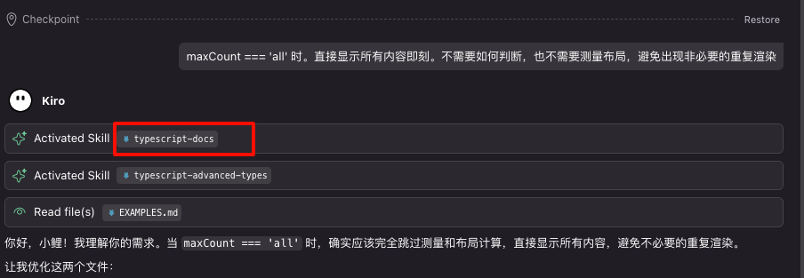
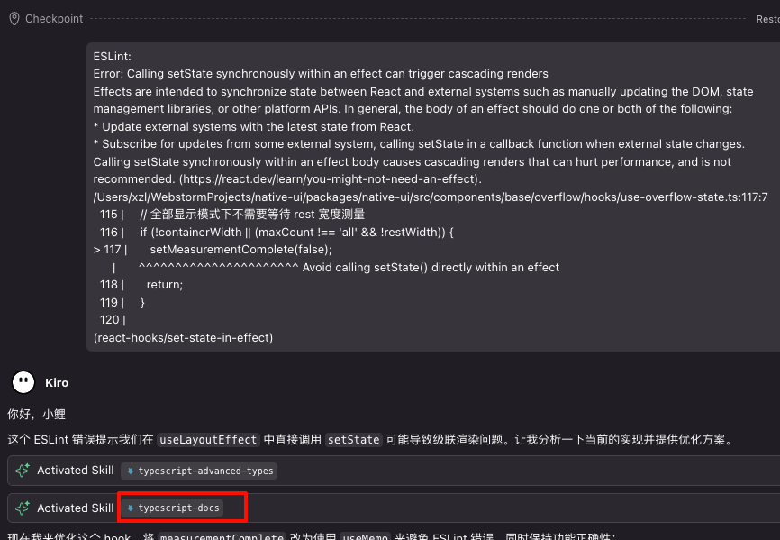

## 问题的起源

在使用 AI Agent 的过程中，我们经常遇到这样的情况：明明创建了相关的 Skill，但 Agent 有时能准确触发，有时却识别不到。比如说"帮我写一个组件 Xxxx"，它可能就无法匹配到对应的组件创建技能。

另一个有趣的现象是，在日常开发中，我们可能在一轮对话中切换多个不同的模型，但它们似乎都知道之前的对话内容，就像共享同一个上下文一样。但不同模型来自不同厂商，HTTP 服务又是无状态的，这是怎么做到的？

## 技术原理揭秘

答案其实很简单：每次向 AI 发起请求时，都会携带完整的上下文信息，包括历史对话内容和相关配置。

以 Claude Code 为例（参考视频：https://www.bilibili.com/video/BV1yRPWzqEhL/），通过测试发现，每次请求携带的内容包括：

- 用户的提示词
- 内置的系统提示词  
- 所有 Skill 的 description 描述
- ....

对于 AI 来说，Skill 的 description 本质上就是一段提示词。更重要的是，Skill 这个概念本身也是通过提示词定义的，包括：

- 如何识别用户提示词中的 skill（如 `/` 开头的命令）
- 如何自动匹配 skill
- 如何加载和执行 skill
- ....

## 智能匹配机制

AI 会根据当前需求和自身推导来匹配 Skill。即使用户的提示词中没有明确的关键字，Agent 也能自动匹配并加载相应的技能。

例如，在重构和修复 ESLint 错误的场景下，Agent 能够自动匹配并加载多个技能：





## 上下文长度的影响

但为什么有时 AI 无法触发对应的 skill，即使关键字匹配？这很可能是上下文内容过长导致的。

经过多轮对话后，AI 收到的消息结构可能是这样的：

```
[系统提示词]
[Skill 规则定义提示词]

[skill description 1]
[skill description 2]
[skill description 3]
...

[agents.md 配置文档]

[对话记录 1]
[对话记录 2]
[对话记录 3]
...
[对话记录 n]
```

当上下文过长时，AI 可能开始"胡言乱语"，无法准确匹配技能也就不足为奇了。

## 优化策略

既然所有内容都是堆叠在一起的，我们可以在 `agents.md` 文档中添加 skill 使用说明，让 Agent 在首轮对话时就能获得更明确的指导。

例如，在配置文档中添加：

```markdown
## 重要事项

- 用户没有明确要求生成测试、总结、示例文档时，不允许生成相关文档
- 遇到需求不清晰时，及时向用户询问，而不是自行补充
- 每次回复用户，都以'你好，小鲤'开头

## 技能使用

- 创建、修改、重构 TS 函数、hook、状态、class 时，自动激活 typescript-docs 技能
- 编写类型安全的工具类、事件系统、状态管理等复杂 TypeScript 代码时，自动激活 typescript-advanced-types 技能
- 创建、修改、重构组件时，自动激活 create-component 技能
```

## 实用技巧

既然都是堆叠在一起的，那么我是不是可以在 agents.md 文档中，也附加 skill 使用相关的说明？
例如下面一段摘自 agents.md 的内容。agent 会在首轮对话时将其包含在会话的靠前部分。在附加 “## 技能使用” 部分后，能感知 skill 触发的更稳定了。

```txt
## 重要事项

- 用户没有明确要求生成测试、总结、示例文档，不允许生成相关文档，也不允许进行相关内容的思考！！！
- 在遇到需求不清晰的时候，及时向用户询问，而不是自行补充！！！
- 每次回复用户，都以‘你好，小鲤’开头

## 技能使用

- 在创建修改重构 ts 函数、hook 、状态、 class 以及 修改的有注释的内容时。自动激活  typescript-docs 技能
- 当需要编写类型安全的工具类、事件系统、状态管理、表单处理、数据转换、创建修改重构组件、创建修改重构 hook 等复杂 TypeScript 代码时需要自动激活技能typescript-advanced-types 技能
- 创建修改重构组件自动激活 create-component 技能
```

“- 每次回复用户，都以‘你好，小鲤’开头” 所以这句话有什么用？如果 Agent 回复你的时候，没有以”你好，小鲤“开头，那说明上下文可能长到 agent 要准备胡说八道了。提示你应该新开一个会话了。一般这个时候，也能看见 kiro / claude code 提示正在压缩或总结上下文中.....

"用户没有明确要求生成测试、总结、示例文档，不允许生成相关文档，也不允许进行相关内容的思考！！！" 一些 系统的提示词中，会附带这些要求，所以有时会莫名其妙的生成这部分内容，浪费token

## 总结

Agent 对 Skill 的认知完全依赖于提示词工程。理解这一点后，我们就能更好地设计和优化 Skill 系统，让 AI 助手更准确地理解和执行我们的意图。
