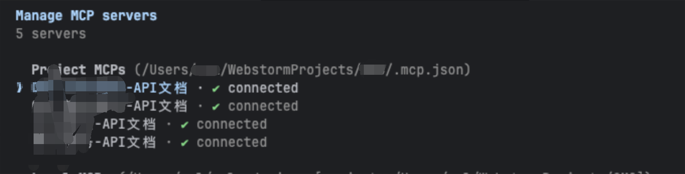
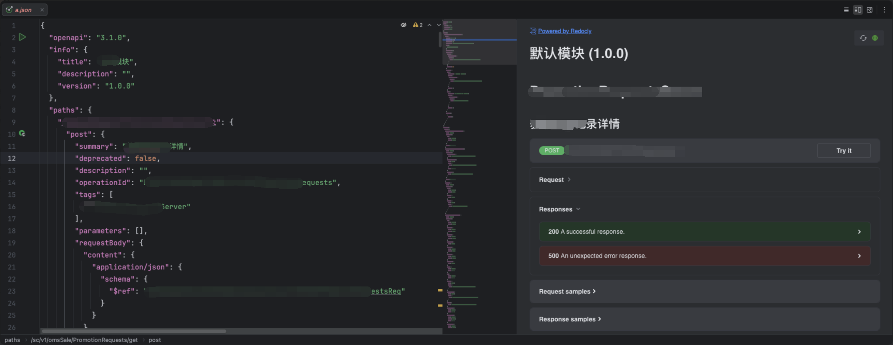

## MCP 目前的问题

官方的 MCP 文档：https://docs.apifox.com/6327888m0

```json
{
  "mcpServers": {
    "API 文档1": {
      "command": "npx",
      "args": [
        "-y",
        "apifox-mcp-server@latest",
        "--project=<project-id1>"
      ],
      "env": {
        "APIFOX_ACCESS_TOKEN": "<access-token>"
      }
    },
    "API 文档2": {
      "command": "npx",
      "args": [
        "-y",
        "apifox-mcp-server@latest",
        "--project=<project-id2>"
      ],
      "env": {
        "APIFOX_ACCESS_TOKEN": "<access-token>"
      }
    }
  }
}
```

在 OMS 项目中，存在多个 APIFOX 的 MCP 服务，其中一个API项目（模块）对应一个 MCP 服务。



MCP 服务在使用之前都需要先手动启用。每个对话的开始，都会先加载已启用的 MCP 的工具清单。
APIFOX的 MCP 清单是这样的一串内容（MCP tool/list 指令的结果）：

```json
{
  "jsonrpc": "2.0",
  "id": 1,
  "result": {
    "tools": [
      {
        "name": "read_project_oas_qtcjdm",
        "description": "读取“默认模块”的 OpenAPI Spec 文件内容",
        "inputSchema": {
          "type": "object",
          "properties": {
            "_": {
              "type": "string"
            }
          },
          "additionalProperties": false,
          "$schema": "http://json-schema.org/draft-07/schema#"
        }
      },
      {
        "name": "read_project_oas_ref_resources_qtcjdm",
        "description": "读取“默认模块”的 OpenAPI Spec 文件内 $ref 的文件内容, 可以同时获取多个文件内容",
        "inputSchema": {
          "type": "object",
          "properties": {
            "path": {
              "type": "array",
              "items": {
                "type": "string"
              },
              "description": "OpenAPI Spec 文件内 $ref 的值, 可以同时获取多个文件内容, 如：[\"/paths/_get_pet.json\", \"/paths/_get_order.json\"]"
            }
          },
          "required": [
            "path"
          ],
          "additionalProperties": false,
          "$schema": "http://json-schema.org/draft-07/schema#"
        }
      },
      {
        "name": "refresh_project_oas_qtcjdm",
        "description": "从服务器重新下载最新的“默认模块”的 OpenAPI Spec 文件内容",
        "inputSchema": {
          "type": "object",
          "properties": {
            "_": {
              "type": "string"
            }
          },
          "additionalProperties": false,
          "$schema": "http://json-schema.org/draft-07/schema#"
        }
      }
    ]
  }
}
```

这里大概是 2～300 左右的token。也就是说新开一个会话就会有800～1200的token被塞入上下文中。即使你只是发了一个“你好”

OMS-订单处理-API文档、OMS-销售管理-API文档、仓储管理-API文档、聚合服务-API文档会导致加载4份一样的数据到上下文中，只不过对应的
MCP工具名称 不一样。

除此 MCP 的使用流程如下：

1. 读取 OAS 入口文件：调用 read_project_oas，获取 OpenAPI Spec 的根文件，里面包含所有路径的 $ref 引用列表。
2. 在入口中定位接口：根据接口名称（中文名或路径关键词）在返回的路径列表中匹配对应的 $ref 路径，例如：/paths/_
   post_sale-barrel-order_detail.json
3. 读取具体接口定义：
   调用 read_project_oas_ref_resources，传入上一步找到的 $ref 路径（支持批量），获取该接口的完整定义： { "
   path": ["/paths/_post_sale-barrel-order_detail.json"] }
4. 递归解析嵌套 $ref：如果接口定义中的请求体或响应体还有嵌套的 $ref（指向 schemas/ 或 components/），继续调用
   read_project_oas_ref_resources 获取这些数据结构定义。

```txt
read_project_oas
└─ 拿到路径列表
   └─ 按名称匹配 $ref 路径
        └─ read_project_oas_ref_resources([matched_path])
             └─ 若有嵌套 $ref → 继续 read_project_oas_ref_resources([...])
```

综上来说，MCP 是比较耗费 Token 的，并且需要每次使用前手动启动，用完不关闭又会占用较多的 token。那有啥优化办法？

## Skill

总结 MCP 带来的问题：

1. 在会话开始，会加载重复的工具清单描述
2. MCP 的调用过程，会返回比较多的 JSON 数据，需要 Agent 自己思考匹配处理（可能发生递归调用）

如何解决？
使用 skill 的方式定义一份 apifox 的使用技能，技能中仅描述 scripts/index.js node 脚本的使用方式，提供以下命令：

- 模糊搜索接口
- 根据接口的路径获取完整的 openapi json 内容：脚本内自行识别 $ref 并递归处理，用脚步替代 Agent 思考
- 查询模块列表
- 查询模块内的所有接口

那么如何解决不同 apifox 项目需要不同的 mcp 服务呢？
script/index.js支持参数 --projectName 指定 apifox 项目。在script/index.js内部则通过读取环境变量
APIFOX_ACCESS_TOKEN、APIFOX_PROJECT_MAP获取凭据与项目ID，再去发起请求。整个过程对 Agent 来说是接触不到 ACCESS_TOKEN 与
projectId
--projectName 是可选参数，若没有则使用环境变量中的APIFOX_PROJECT_ID，若还没有则抛出异常给 Agent。Agent 会再反馈给用户。

Apifox skill 的目录结构如下：

```text
apifox
├── SKILL.md
└── scripts
└── index.js
```

- scripts/index.js 为一个 nodejs 脚本，负责通过 apifox openapi 接口读取接口描述信息
- SKILL.md 中包含 srcipts/index.js 脚步的调用方式和参数说明

Apifox skill 的内容：https://github.com/Byte-n/skills/blob/master/skills/apifox/SKILL.md

## 使用测试

前置准备，环境变量配置：
export APIFOX_ACCESS_TOKEN="APS-xxxxxx"
export APIFOX_PROJECT_MAP="[{\"label\":\"订单\",\"value\":1},{\"label\":\"销售\",\"value\":2}]"

测试提示词：“将接口 /xxx/get 的 openapi 输出到 a.json 文件中”

```text
❯ 将接口 /xxx/get 的 openapi 输出到 a.json 文件中

⏺ Skill(apifox)
⎿ Successfully loaded skill

⏺ Bash(node .claude/skills/apifox/scripts/index.js search_paths --keyword "/xxx/get")
```

a.json 文件内容如下图所示。



拿到 openapi 结构的内容，此 skill 的使命就完成了。
如果想生成 api 代码代码，应该在业务的 api 代码生成 skill 中：“获取 xxx/xxx 接口的详情....”，就可以触发 Agent 自动激活此
skill。如果需要附带 projectName 参数，应该是“获取 销售 xxx/xxx 接口的详情....”

