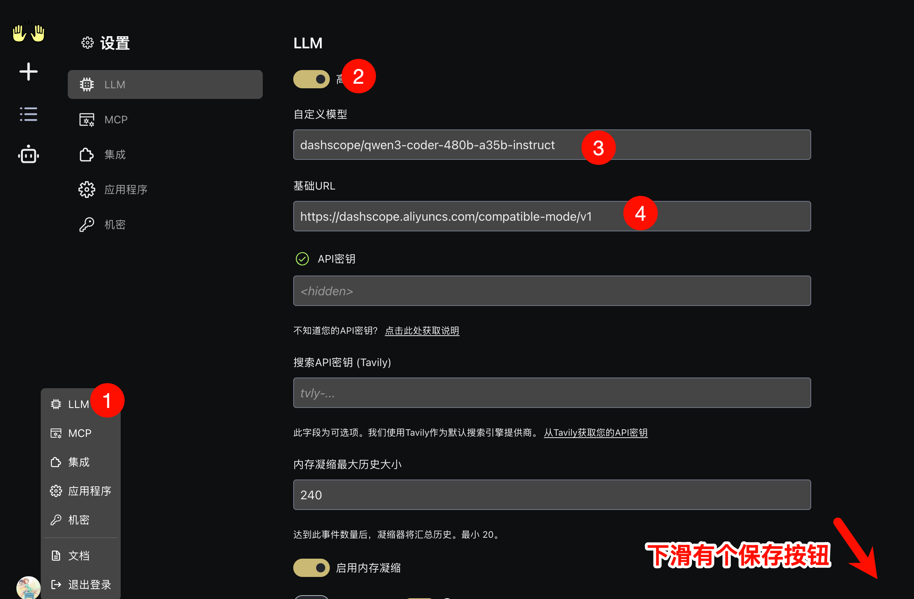
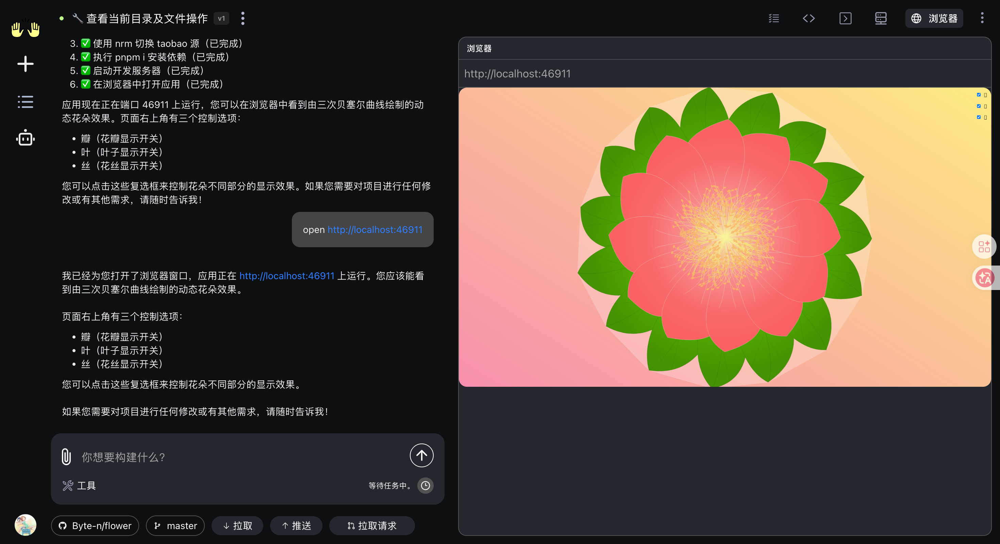
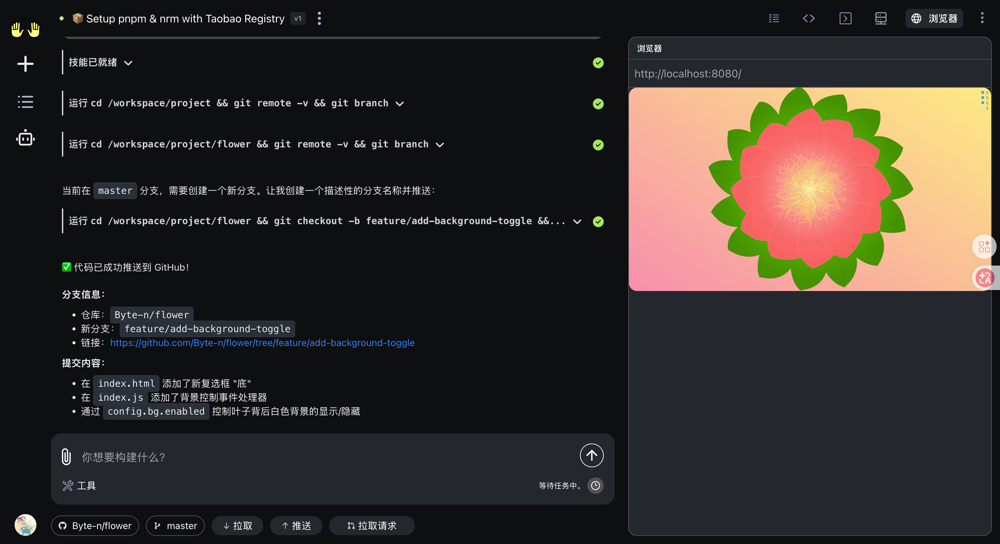

OpenHands（原名 OpenDevin）是一个开源的 AI 软件开发平台和自主智能体（AI Agent），旨在通过人工智能模拟人类开发者的行为来自动化软件开发任务。
它的核心功能和特点包括：
* 自主编程能力：OpenHands 不仅仅是一个聊天机器人，它具备“动手”能力，可以自主修改代码、执行终端命令、浏览网页以及调用 API。
* 端到端任务处理：它可以处理复杂的工程任务，如修复 Bug、生成测试用例、编写文档、进行代码重构以及解决 GitHub 上的 Issue。
* 开源与协作：该项目在 GitHub 上以 MIT 协议开源。它支持多种主流的大语言模型（LLM），并允许开发者在受控的沙盒环境（通常基于 Docker）中运行 AI 智能体，以确保安全性。
* 多平台支持：提供 Web 界面和 命令行工具 (CLI)，并可以通过 Chrome 插件直接在 GitHub 页面上启动任务。
* 对标产品：它常被视为 Cognition AI 公司推出的闭源 AI 程序员 Devin 的开源替代方案。

## 安装

这里使用docker的安装方式。

docker 命令参见：https://docs.openhands.dev/openhands/usage/run-openhands/local-setup#docker-command-click-to-expand

```bash
docker run -it --rm --pull=always \
  -e AGENT_SERVER_IMAGE_REPOSITORY=ghcr.io/openhands/agent-server \
  -e AGENT_SERVER_IMAGE_TAG=1.10.0-python \
  -e LOG_ALL_EVENTS=true \
  -v /var/run/docker.sock:/var/run/docker.sock \
  -v ~/.openhands:/.openhands \
  -p 3000:3000 \
  --add-host host.docker.internal:host-gateway \
  --name openhands-app \
    docker.openhands.dev/openhands/openhands:1.3
```

数据存储在本地的`~/.openhands` 下

## LLM 配置

默认打开 [localhost:3000](http://localhost:3000) 的时候，会有引导窗口让你选择模型提供商，我这里选择 Qianwen 与 qwen3-coder-480b-a35b-instruct 。（[购买/试用链接](https://bailian.console.aliyun.com/cn-beijing/?spm=5176.29619931.J_SEsSjsNv72yRuRFS2VknO.2.136910d7H80yiX&tab=model#/model-market/detail/qwen3-coder-480b-a35b-instruct)，下滑有一个获取API key 的按钮，建议开启“**免费额度用完即停**”，不然你会收到阿里云的欠费通知短信，别问我为什么知道。）

**这里有一个坑：**

```
litellm.BadRequestError: LLM Provider NOT provided. Pass in the LLM provider you are trying to call. You passed model=Qwen/Qwen3-Coder-480B-A35B-Instruct
 Pass model as E.g. For 'Huggingface' inference endpoints pass in `completion(model='huggingface/starcoder',..)` Learn more: https://docs.litellm.ai/docs/providers
```

因为它自动生成的模型名称为：`qianwen/qwen3-coder-480b-a35b-instruct` 。这个是错误的，需要到设置的LLM中修改：

模型：dashscope/qwen3-coder-480b-a35b-instruct

基础URL： https://dashscope.aliyuncs.com/compatible-mode/v1


修改LLM后，仅对新增的会话有效，不影响已有的会话，所以需要重开一个会话验证。

## 试用

有时候准备就绪了，但是项目工作目录下没有代码文件，则是远程仓库拉取失败。

### 启动项目

`npm i`时终端长时间未响应（openhands 未收到输出结束符合）会认为超时，会中断重试。例如使用：“全局安装 nrm 、 pnpm ，并使用 nrm 切换为 taobao 源，然后执行 `pnpm i` 与 `pnpm run dev`”。或者使用项目级的配置文件实现。



### 根据需求修改功能，并推送

https://github.com/Byte-n/flower/tree/feature/add-background-toggle



## 扩展

### MCP

参考文档：https://docs.openhands.dev/overview/model-context-protocol

在 openhands 的配置文件（config.tom 已标记弃用）、网页UI设置（好像对于setting.json文件）中可以配置 MCP 服务器。

支持 SHTTP、SSE、STDIO 三种

### Skills

参考文档：https://docs.openhands.dev/overview/skills

包含两部分，一部分是 openhands 内置功能相关的，例如 git 操作，npm 操作，内置的浏览器预览等。另外一部分是项目级别的，会自动识别以下目录中的：

```text
your-repository/
├── AGENTS.md                       # 永久仓库指令（推荐）
└── .agents/
    └── skills/
        ├── my-skill/               # AgentSkills 标准格式
        │   └── SKILL.md
        └── legacy_trigger.md       # 旧格式（关键词触发）
```

### 自定义工作空间的docker镜像

参加一个自定义的 docker 镜像，在通过 docker 启动 openhands 的时候，使用 `SANDBOX_BASE_CONTAINER_IMAGE`  参数指定自定义的镜像。

为不同的项目配备单独的 openhands 与 工作空间镜像。工作空间镜像中预设项目环境，固定新需求的基础代码分支等等

```bash
docker run -it --rm --pull=always \
    -e SANDBOX_BASE_CONTAINER_IMAGE=custom-image \
    ...
```

### 飞书机器人集成的可能实现方式

通过openhands api 的方式，将输入与输出 中转到 openhands 。

通过飞书机器人私聊、艾特的方式创建一个项目，机器人会参加一个飞书群聊对应 openhands 的一个会话。群聊 ID 与 openhands 会话 ID 关联。