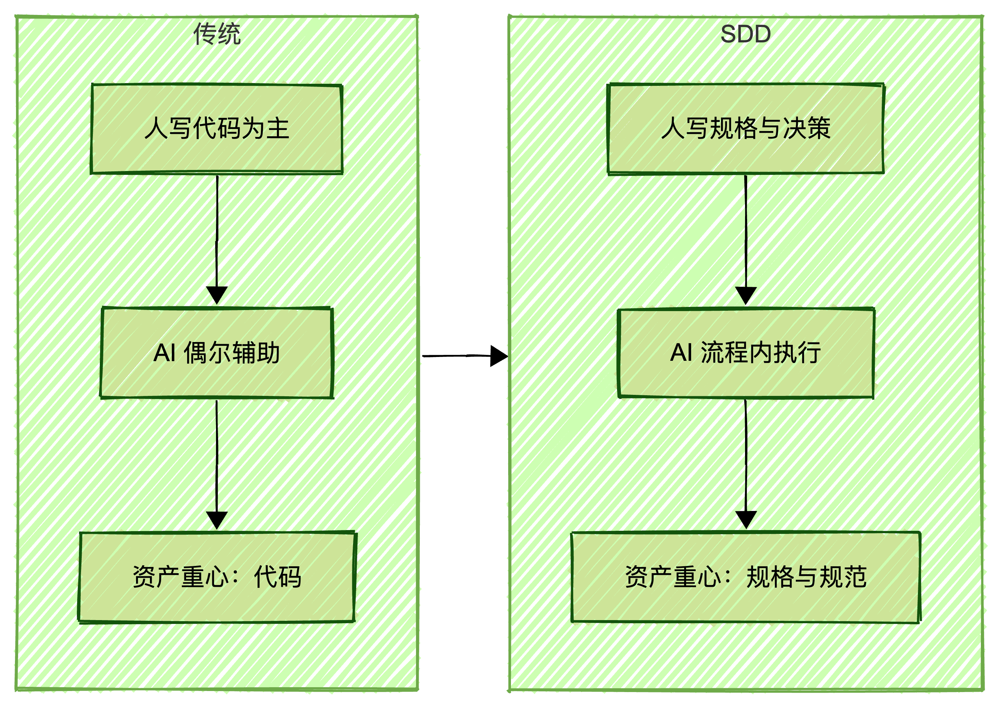
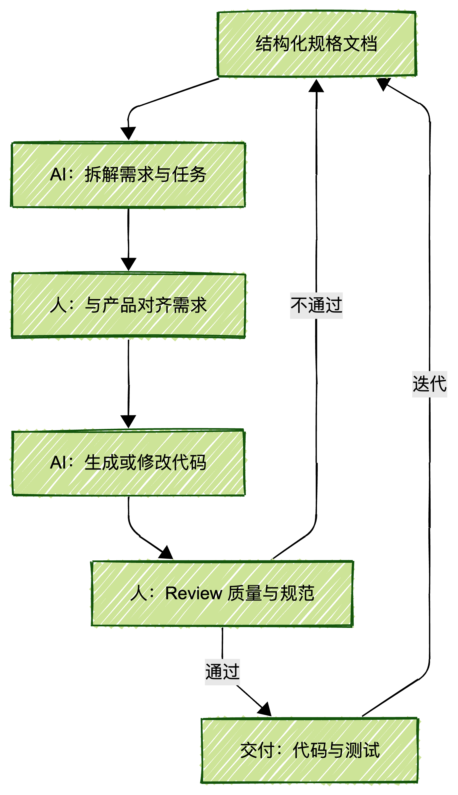

## 文档概述

本文档系统介绍 **OpenSpec** 框架——一套专为 AI 编程助手设计的规格驱动开发（SDD）方法论。通过结构化文档驱动开发流程，确保人与 AI 在"构建什么"和"如何构建"上达成共识，从而减少返工、提升协作效率、实现知识沉淀。

| 章节 | 内容概述 |
| --- | --- |
| **1. 规格驱动开发** | SDD 核心理念、与 Vibe Coding 及 TDD 的区别、知识沉淀闭环机制 |
| **2. OpenSpec 框架** | 文件目录结构、核心概念（Change/Delta Spec/Artifacts）、工作流程详解、Schema 自定义配置 |
| **3. 实践案例** | 默认工作流局限性分析、示例项目定制流程实战（crud-schema）、自定义约束机制设计 |
| **4. AGENTS.md** | AI 项目手册编写指南、渐进式规范加载策略、示例模板 |
| **附录** | 待补充内容与后续规划 |


---

## 引言

在 AI 辅助编程成为主流的今天，开发者与 AI 的协作方式正在经历根本性转变。传统的 "Vibe Coding" 模式——凭直觉直接编码、让 AI 自由发挥——虽然能快速产出代码，却常常导致方向性偏差和频繁返工。


**核心痛点**：

- **需求理解偏差**：模糊的自然语言描述让 AI 产生错误假设
- **上下文碎片化**：AI 缺乏系统的业务背景，难以做出正确决策
- **知识无法沉淀**：实现细节散落在代码注释中，新需求无法复用历史经验
	
	
**规格驱动开发（SDD）** 的核心理念是：在编写代码之前，先通过结构化文档明确"构建什么"和"如何构建"，让 AI 在清晰的规格约束下工作，而非猜测需求。


本文将系统介绍：

1. **SDD 理论基础** —— 与传统开发范式的对比
2. **OpenSpec 框架** —— 专为 AI 协作设计的规格驱动工作流
3. **实践案例** —— 如何为具体项目定制约束机制
4. **AGENTS.md** —— 打造 AI 友好的项目知识库
	
	
---


### 1. 规格驱动开发

#### 1.1 概述

规格驱动开发（Specification-Driven Development，SDD）强调在编写代码前先定义系统规格说明，通过结构化文档驱动开发过程，确保人与 AI 对"构建什么"和"如何构建"达成共识。


**核心价值**：

- **减少返工**：避免方向性偏差
- **提升协作**：规格文档成为人与 AI 的共同语言
- **知识沉淀**：业务逻辑结构化存储
- **质量保障**：明确规格约束降低缺陷率
	
	
**工作流程**：需求分析 → 规格编写 → 设计方案 → 任务分解 → 编码实现 → 验证归档


#### 1.2 SDD 与 Vibe Coding 区别

**Vibe Coding** 是即兴式编程，凭直觉直接编码，缺乏系统化规划。在 AI 协作场景下，模糊需求导致生成代码偏离预期。

| 对比维度 | Vibe Coding | 规格驱动开发（SDD） |
| --- | --- | --- |
| **工作流程** | PLANNING → IMPLEMENTING → DONE | proposal → specs → design → tasks → implement |
| **需求定义** | 模糊、口头描述 | 结构化文档、明确约束 |
| **变更管理** | 随意修改，缺乏追溯 | 增量规范，版本可追溯 |
| **AI 协作** | 频繁返工，理解偏差大 | 上下文清晰，执行准确 |
| **知识沉淀** | 依赖代码注释和记忆 | 规格文档持续更新 |
| **团队协作** | 依赖口头沟通 | 文档驱动，异步协作 |
| **质量保障** | 事后测试发现问题 | 事前规格约束问题 |


**知识沉淀闭环**：通过"归档 → 读取 → 迭代 → 再归档"，AI 在一致的业务上下文中持续工作。


#### 1.3 为什么选择 OpenSpec

OpenSpec 是专为 AI 编程助手设计的规格驱动开发框架，核心优势：


**1. AI 协作优化**：结构化提示词模板、增量规范（Delta Spec）、工作流状态管理

**2. 渐进式流程**：`proposal → specs → design → tasks → implement`，明确产出物和依赖关系

**3. 灵活定制**：通过 `schema.yaml` 自定义工作流，支持 fork 和修改

**4. 知识沉淀**：归档机制形成"归档 → 读取 → 迭代 → 再归档"闭环

**5. 变更追溯**：独立管理每个变更，增量规范（ADDED/MODIFIED/REMOVED）清晰记录变化

**6. 轻量集成**：基于 Markdown 和 YAML，无缝集成 Git 和 CI/CD


**设计哲学**：让 AI 在明确规格指导下工作，而非猜测需求。


##### 与 Spec-kit 的对比

相比 GitHub 官方的 Spec-kit，OpenSpec 在定位和设计理念上有明显差异：


**定位差异**

- **OpenSpec**：主张轻量化与非侵入式。设计初衷是提供一个敏捷的 SDD（规范驱动开发）框架，强调文档简洁易读（通常比同类工具精简 60% 以上），降低人类审核的认知负载。
- **Spec-Kit**：主张严谨性与重型工程规范。通过极其详尽的阶段划分（Constitution, Specify, Plan, Tasks, Implement）来确保 AI 的输出达到工业级的一致性。
	
	
**工作流差异**

- **OpenSpec（三步走）**：Proposal（提案）→ Apply（实施）→ Archive（归档）。流程流畅，适合快速迭代。
- **Spec-Kit（五阶段）**：Constitution（宪章）→ Specify（需求）→ Plan（架构）→ Tasks（任务）→ Implement（实现）。阶段分离更适合职责明确的团队。
	
	
**技术特性对比**

| 特性 | OpenSpec | Spec-Kit |
| --- | --- | --- |
| 设计背景 | 社区驱动 / 开源框架 | GitHub / Microsoft 官方背景 |
| 项目场景 | 既有项目：擅长增量修改 | 新项目：擅长从 0 到 1 构建 |
| 文件结构 | `.spec` 目录按任务归档 | 依赖 Git 分支，文档较庞大 |
| 运行环境 | TypeScript / Node.js（轻量） | Python（环境依赖较重） |
| 自动化程度 | 辅助式，开发者控制分支 | 高度自动化，自动创建分支 |


> 💡 **实际体验**：使用 Spec-kit 时曾遇到 mac 的 Python 环境冲突问题。相比之下 OpenSpec 对环境更友好。
> 


#### 1.4 从 TDD 到 SDD：开发范式的演进

测试驱动开发（TDD）曾是敏捷开发的黄金标准，强调"先写测试，后写代码"。而在 AI 辅助编程时代，规格驱动开发（SDD）正在成为新的最佳实践。


##### 核心理念的转变

| 维度 | TDD（测试驱动开发） | SDD（规格驱动开发） |
| --- | --- | --- |
| **核心问题** | "代码是否正确？" | "我们是否在构建正确的东西？" |
| **验证对象** | 代码行为是否符合预期 | 需求理解是否与业务目标一致 |
| **前置条件** | 需求已明确，直接推导测试用例 | 先澄清需求，再定义规格 |
| **产出物** | 测试代码 + 实现代码 | 规格文档 + 设计方案 + 代码 |
| **AI 协作** | 难以直接参与测试设计 | 全程参与规格讨论与设计 |
##### 工作重心的转变



**从"验证正确性"到"定义正确性"**

传统 TDD 假设需求已经清晰，开发者只需将需求转化为测试用例。但在实际项目中，需求往往模糊、不完整，甚至相互矛盾。SDD 要求团队在编码前投入更多精力澄清"做什么"和"为什么做"，而非急于验证"做得对不对"。


**从"代码优先"到"文档优先"**

TDD 的测试代码本质是可执行的需求文档，但它只描述"行为"，不解释"意图"。SDD 的规格文档则包含完整的设计 rationale，成为人与 AI 的共同语言，也为后续维护者提供上下文。


**从"个人技艺"到"团队协作"**

TDD 高度依赖开发者的测试设计能力。SDD 则通过结构化文档降低协作门槛，产品经理、设计师、开发者和 AI 都能在统一规格下工作，减少沟通损耗。


##### 对团队工作流程的影响

**1. 需求澄清前置**

在 SDD 流程中，需求分析从"编码前的一小时讨论"扩展为"持续迭代的规格编写"。团队需要更早投入时间理解业务目标，但换来的是更少的返工和更清晰的技术决策依据。


**2. 代码审查变轻，规格审查变重**

传统 Code Review 关注实现细节和边界情况。SDD 则将审查重心前移至规格阶段：设计是否合理？是否覆盖所有业务场景？是否与现有架构冲突？一旦规格通过审查，代码实现通常是机械性的。


**3. AI 成为真正的"协作者"**

TDD 模式下，AI 主要用于代码补全和简单重构，难以参与架构决策。SDD 的结构化文档让 AI 能够在设计阶段就介入，帮助分析方案优劣、预测潜在风险，甚至生成部分规格内容。


**4. 知识管理从隐性到显性**

TDD 的知识沉淀依赖测试代码和代码注释，新成员需要阅读大量代码才能理解业务。SDD 的归档机制则将设计决策、业务规则、架构约束显性化，形成可检索、可复用的组织资产。


##### TDD 并未消失

需要强调的是，SDD 并非取代 TDD，而是将其置于更完整的流程中：

```
需求澄清 → 规格定义 → 设计方案 → 任务分解 → 【TDD: 测试 → 实现 → 重构】→ 验证归档
```


TDD 仍然是实现阶段的有效实践，但它不再是起点。SDD 为 TDD 提供了更稳固的基础：明确的规格让测试用例设计更系统，清晰的设计让代码结构更可预测。


对于习惯 TDD 的团队，迁移到 SDD 并不意味着放弃已有的测试实践，而是在其之前增加"规格定义"环节，让测试不再是对模糊需求的猜测，而是对明确规格的验证。


### 2. OpenSpec 框架详解

OpenSpec 是一套面向 AI 编程助手的规格驱动开发（Spec-Driven Development）框架。其核心理念是：在任何代码被编写之前，先让你和 AI

助手对「构建目标」达成共识，让 AI 在落地实现前充分理解需求，从而大幅降低返工率，避免方向性偏差

相比之下，传统 Vibe Coding 的工作流程极为粗放：

```
PLANNING ──► IMPLEMENTING ──► DONE  
```

而 OpenSpec 将这一过程拆解为更清晰、可控的五个阶段：

```
proposal ──► specs ──► design ──► tasks ──► implement
```

每个阶段都有明确的产出物，确保从需求到实现的每一步都有据可查、有迹可循。


#### 2.1 文件目录说明

```
openspec/
├── config.yaml                          # 核心配置文件，定义 OpenSpec 的运行行为
├── changes/                             # 变更记录根目录
│   ├── add-artifact-regeneration-support/ # 正在进行的单次需求变更
│   │   ├── specs/                       # 本次变更涉及的具体规范草稿 (*.md)
│   │   ├── design.md                    # 详细设计文档
│   │   ├── tasks.md                     # 任务分解与进度追踪
│   │   └── proposal.md                  # 核心提案文件
│   └── archive/                         # 已完成并归档的变更目录
│       └── 2025-01-11-add-update-command/ # 历史变更示例
│           ├── design.md
│           ├── proposal.md
│           ├── specs/
│           │   └── cli-update/
│           │       └── spec.md
│           └── tasks.md
└── specs/                               # 最终生成的业务规范（Source of Truth）
    └── ai-tool-paths/                   # 归档后沉淀到全局的业务逻辑定义
        └── spec.md
```


当执行 `opsx:archive add-artifact-support` 命令后，openspec 会分析 add-artifact-support 目录下的内容：

- 提取 spec 业务规范到 openspec/specs/ 目录下
- 将整个变更记录移动到 openspec/changes/archive/ 目录下，文件夹格式：`{YYYY-MM-dd}-add-artifact-support`;


`openspec/specs/` 是已完成的业务规范。在后续对相关业务进行功能变更、BUG修改时，可以引用此部分的内容，用于让 AI 熟悉相关业务。


#### 2.2 核心概念

##### 2.2.1 变更（Change）

变更是 OpenSpec 中的基本工作单元。每一次功能开发、Bug 修复或重构，都对应一个独立的变更目录，存放在 openspec/changes/<

change-name>/ 目录下。

```
openspec/changes/<name>/
├── proposal.md       # 需求与目标提案
├── specs/            # 功能规格
├── design.md         # 技术设计方案
└── tasks.md          # 可执行的任务清单
```


##### 2.2.2 增量规范（Delta Spec）

描述「相对现有规格发生了什么变化」，使用 ADDED / MODIFIED / REMOVED 三个章节增量记录，归档时自动合并到主规格。


```markdown
# Delta for Auth

## ADDED Requirements

### Requirement: Two-Factor Authentication

The system MUST support TOTP-based two-factor authentication.

## MODIFIED Requirements

### Requirement: Session Timeout

The system SHALL expire sessions after 30 minutes. (Previously: 60 minutes)

## REMOVED Requirements

### Requirement: Remember Me (Deprecated in favor of 2FA)
```


##### 2.2.3 Artifacts

OpenSpec 会追踪每个阶段的变更文档的就绪状态，确保规划始终按正确顺序推进——只有前置阶段变更完成后，后续阶段的文档才会生成。


#### 2.3. 工作流程

```
proposal (提案) ──► specs（规范） ──► design（设计） ──► tasks（任务） ──► apply (实施) [ -> archive (归档) ]
```

- 提案：建立"为什么要做这个变更"的基础共识
- 规范：业务流程、功能规范
- 设计：在技术层面如何实现（架构设计、页面状态设计、目录组织...)
- 任务：规范、设计生成生成任务列表
- 实施：执行提案阶段生成的任务列表
- 归档：将完成后的提案内容存档（openspec/changes/archive/）、记录业务规范（openspec/specs/）
	
	
##### 2.3.1 默认流程

`spec-driven` 是 OpenSpec 的默认工作流，采用 **proposal → specs → design → tasks** 的渐进式规范流程。

该工作流强调在编码之前先对齐需求，确保人与 AI 在"做什么"和"怎么做"上达成一致。


在 OpenSpec 中工作流是可以自定义配置和修改的。上述提到的默认工作流`spec-driven`

的配置可以在这里查到：[OpenSpec Spec-driven](https://github.com/Fission-AI/OpenSpec/tree/main/schemas/spec-driven)


此工作流的组成如下：

```
schemas
└── spec-driven
    ├── schema.yaml
    └── templates
        ├── design.md
        ├── proposal.md
        ├── spec.md
        └── tasks.md
```

- `schema.ymal` 为流程的配置文件，描述流程有哪些步骤，生成哪些文档，流程如何工作（Apply）。
- templates 下的为文档模版，进一步规范 AI 生成的模版内容。
	
	
可以理解为 `schema.ymal` 定义流程如何工作、需要经历哪些步骤，如何获取 templates 中所需要的数据并生成最终的文档。

schema.yaml 文件内容如下：

```yaml
name: spec-driven
version: 1
description: Default OpenSpec workflow - proposal → specs → design → tasks
artifacts:
  - id: proposal
    generates: proposal.md
    description: Initial proposal document outlining the change
    template: proposal.md
    instruction: |
      Create the proposal document that establishes WHY this change is needed.
      ...
    requires: [ ]

  - id: specs
    generates: "specs/**/*.md"
    description: Detailed specifications for the change
    template: spec.md
    instruction: |
      Create specification files that define WHAT the system should do.
      ...
    requires:
      - proposal

  - id: design
    generates: design.md
    description: Technical design document with implementation details
    template: design.md
    instruction: |
      Create the design document that explains HOW to implement the change.
      ...
    requires:
      - proposal

  - id: tasks
    generates: tasks.md
    description: Implementation checklist with trackable tasks
    template: tasks.md
    instruction: |
      Create the task list that breaks down the implementation work.
      ...
    requires:
      - specs
      - design

apply:
  requires: [ tasks ]
  tracks: tasks.md
  instruction: |
    Read context files, work through pending tasks, mark complete as you go.
      ...
```


此阶段的依赖关系如下：

```
proposal # 建立"为什么要做这个变更"的基础共识
    ↓
specs    # 定义应该做什么（WHAT）
    ↓     
design   # 解释如何实现变更（HOW）
    ↓
tasks.   # 将实现工作分解为可追踪的任务清单
    ↓
apply (执行并追踪 tasks.md)
```


##### 2.3.2 自定义流程说明

OpenSpec 的核心优势在于其灵活的工作流定制能力。通过自定义 Schema，你可以根据项目类型、团队规范或开发场景，设计最适合的开发流程。


###### Schema 基础

**Schema 的本质**：Schema 是一个定义开发工作流，它规定了 AI 在生成代码前必须产出的"文档链"（Artifacts）及其依赖关系。


**核心组成**：

- `schema.yaml`：定义工作流结构、制品依赖关系
- `templates/`：每个制品的 Markdown 模板文件
- `instruction`：指导 AI 如何生成每个制品的提示词
```yaml
name: 流程名称
version: 1
description: 流程介绍
artifacts:
  - id: 流程第一个步骤节点
    generates: 产出文档.md
    description: 流程介绍
    template: 产出文档的原始模版.md
    instruction: |    ...
    requires: |
        提示词，用于处理此阶段的任务（如何获取数据，需要用户提供什么内容，如何生成该阶段的文档...任何事情，也可以调用
  mcp、skill 等）
    
  - ...

# 执行 apply 命令时，会根据工作流的 apply 配置来获取任务列表
apply:
  requires: [依赖步骤节点]
  tracks: 任务进度跟踪文件.md
  instruction: |
    ...
```


###### 创建自定义 Schema

**方式一：从头创建**

```bash
openspec schema init my-workflow
```

**方式二：基于现有 Schema 创建**

```bash
openspec schema fork spec-driven my-workflow
```

**验证 Schema**

```bash
openspec schema validate my-workflow
```


###### 典型定制场景

https://github.com/intent-driven-dev/openspec-schemas/tree/main/openspec/schemas


###### 场景 1：精简模式（Minimalist）

适用于小型改动、Bug 修复，跳过冗长的提案和设计阶段：

```yaml
name: minimalist
version: 1
description: Lightweight workflow for quick fixes
artifacts:
  - id: readme
    generates: README.md
    template: readme.md
    instruction: |
      Create a brief README explaining what changed and why.
    requires: [ ]

  - id: tasks
    generates: tasks.md
    template: tasks.md
    instruction: |
      Break down the implementation into concrete tasks.
    requires: [ readme ]

apply:
  requires: [ tasks ]
  tracks: tasks.md
```

**依赖关系**：`readme → tasks → apply`


##### 2.3.3 使用自定义 Schema

**启用自定义 Schema**：

```bash
# 方式 1：在项目配置中设置
# 编辑 openspec/config.yaml
schema: contract-first

# 方式 2：创建变更时指定
/opsx:propose add-payment-api --schema contract-first
```


**查看当前状态**：

```bash
openspec status --change add-payment-api
```


输出示例：

```
Change: add-payment-api
Schema: contract-first

Artifacts:
  ✓ proposal      (done)
  ✓ api-contract  (done)
  → specs         (ready) ← Next to create
  ⊘ design        (blocked by: api-contract)
  ⊘ tasks         (blocked by: specs, design)
```


##### 2.3.4 常见问题


- 在 OpenSpec 生成规格文档的过程中，若发现规格文档中的内容与需求不符，如何处理？
> **必须手动纠正后再继续**。AI 生成的规格文档基于提示词和上下文理解，可能存在偏差。发现不符时：
> 
> 1. **立即停止**：不要在错误的基础上继续生成后续文档或代码
> 2. **手动修正**：直接编辑相关文档（`proposal.md`、`specs/*.md`、`design.md`）
> 3. **保持逻辑闭环**：修改时注意保持文档间的一致性
> 	- `proposal.md` 中的目标变更必须在 `specs/*.md` 中有对应的功能规格
> 	- `specs/*.md` 中的功能必须在 `design.md` 中有技术实现方案
> 	- 如果修改了上游文档（如 `proposal.md`），需要检查下游文档是否需要同步调整
> 4. **验证后继续**：修正后使用 `/opsx:verify` 验证一致性，再继续流程


- 在当前 `changes/xxx` 需求中，手动修改了代码如何同步到文档。
> OpenSpec 不强制单向流程，artifacts 和代码之间允许双向迭代调整。
> 
```
手动修改代码后:
    ↓
编辑 tasks.md / design.md 反映实际实现
    ↓
/opsx:verify    ← 验证一致性
    ↓
/opsx:apply     ← 继续（如果有剩余任务）
    ↓
/opsx:archive   ← 归档（会自动提示 sync specs）
```

- 在 `archive` 归档某个功能后，手动对代码进行了修改并影响了业务规范，如何同步到 'openspec/specs/xxxx' 对应业务规范中？
需要后补流程，确保规范与现实一致：

归档后手动修改代码 → 创建新 Change 记录这些修改 → 归档新 Change，或者借助 AI 根据旧的规范 + 现实代码 输出新的规范，并替换


#### 2.4 Context 注入与规则定制

在 `openspec/config.yaml` 中配置项目级上下文和规则：

```yaml
schema: contract-first

context: |
  描述业务规范，也可以：‘读取 AGENTS.md’ 直接读取项目已有规范

rules:
  api-contract:
     contract-first 流程特定节点的补充约束
```


### 3. 实践案例：自定义流程定制

本章以一个真实的前端 CRUD 项目为例，展示如何针对默认工作流的不足，定制专属的 OpenSpec Schema 来约束 AI 输出。

#### 3.1 业务流程梳理

##### 问题：默认工作流的局限性

OpenSpec 默认的 `spec-driven` 工作流是通用的，但在实际项目中，AI 生成的文档往往**过于抽象**，缺少项目特定的关键信息。

**典型问题**：

- `proposal.md` 只描述"做什么"，缺少业务细节
- `specs/*.md` 规范过于宽泛，不够具体
- `design.md` 技术方案不够详细，缺少项目约束
- `tasks.md` 任务分解不够精细，难以直接执行


##### 传统方式的痛点

```
设计稿 + 需求文档 + API 文档
         ↓
   开发者手动整理
         ↓
   投喂给 AI（长文本）
         ↓
   AI 直接生成代码
```

**问题**：

1. **信息散乱**：需要从多个来源手动提取信息
2. **缺少结构**：投喂的内容是非结构化的长文本
3. **难以审查**：AI 直接生成代码，中间缺少可审查的设计文档
4. **不可复用**：每次都要重新整理和投喂


##### 解决方案：定制化 Schema

通过自定义 OpenSpec Schema，让 AI 生成**结构化的、项目特定的**设计文档：

```
设计稿 + 需求文档 + API 文档
         ↓
   投喂给 AI（使用自定义 Schema）
         ↓
   AI 生成结构化文档
         ↓
   开发者审查 + 修改
         ↓
   AI 基于审查后的文档生成代码
```

**核心思路**：

- **将"隐性知识"显性化**：把开发者脑中的经验固化为 Schema，通过模板和 instruction 引导 AI 按规范提取信息
- **建立"审查点"**：在需求和代码之间插入结构化的设计文档，开发者审查后的文档成为后续实现的唯一依据


#### 3.2 流程定义

定制流程的核心目的不是"指导"AI，而是**约束 AI**——在开发实施前固定所有不允许 AI 擅自思考的内容，解决 AI 在实际开发中反复出错的痛点。

**定制流程的方法论**：

1. **识别 AI 易犯错误**：收集项目中 AI 反复出错的场景（如命名不规范、目录结构混乱、字段关系遗漏等）
2. **设计约束机制**：针对每类错误，在 schema.yaml 的 instruction 或模板中添加对应的强制/禁止规则
3. **模板层填空化**：将 design.md 等文档的每个章节设计为"填空题"，限制 AI 自由发挥空间
4. **多阶段强制契约**：通过 `proposal → specs → design → tasks → apply` 的依赖链，确保每一步都有明确约束

**约束类型示例**：

- **强制读取**：必须先读取指定文件/接口后才能生成内容
- **格式固定**：输出必须严格遵循模板结构
- **禁止脑补**：无文档来源的内容不得写入
- **单一职责**：每个阶段只关注特定层面，不越界

**版本控制与团队共享**：

自定义 Schema 位于项目目录下，与代码一同版本控制。当 AI 在某一类任务上反复出错时，直接修改 schema.yaml 的 instruction 或模板——让约束成为流程的一部分，而不是人的负担。


#### 3.3 演示与验证

实际使用中，通过 `/opsx:new` 创建提案，手动推进每一个步骤（`/opsx:continue`），在下一个步骤开始前审查、修改上一个步骤输出的文档，确保后续步骤生成的内容准确。

**关键验证点**：

- AI 生成的各阶段文档是否符合模板约束
- 归档后再次发起变更时，AI 是否能正确读取并引用之前的业务规范
- 实施阶段生成的代码是否遵循 design.md 中的技术决策

**常见偏差原因**：

- 需求文档描述不清楚，导致 `specs/*.md` 与 `design.md` 中遗漏关键信息
- `AGENTS.md` / 提示词未覆盖特定场景的规范
- `proposal.md` 中的排除约束过于笼统，影响了相关功能的生成


#### 3.4 效果对比

对比使用默认流程与自定义流程的结果：

- **默认流程**：AI 自由发挥，容易偏离设计稿和 API 文档，输出不符合项目规范
- **定制流程**：通过约束机制，AI 输出更贴合项目实际要求，减少返工


### 4. AGENTS.md 项目手册


OpenSpec 输出的文档中包含详细的需求、业务规范、详细的系统设计、可拆分的任务。这些可以让 AI 输出符合需求功能。

这里还缺少一环，用于告诉 AI 项目的编码规范、页面规范、组件使用规范等，规范 AI 输出的实际代码质量，确保 AI 输出的代码质量、风格与项目一致。


这里常用的规范手段有 Rules、Skills、AGENTS.md。对于这三者的，不同的编程工具的支持度也不同，里面指令的优先级也不同。

例如 Claude code 中 Rules 支持 路径匹配、提示词匹配等方式，同时 Rules 中的提示词的优先级介于系统提示词与用户提示词中，且对此部分的 Tokens 消耗也更少（好像是缓存手段）


这选用的是 AGENTS.md 文档的方案，此方案支持的 AI 工具更多、移植性也更好

> 例如 Claude Code 默认不读取此文件，手动创建 CLAUDE.md 在里面包含 `@AGENTS.md`即可。Claude Code 默认会读取 CLAUDE.md。
> 


理论上你也可以在 AGENTS.md 中包含任何指令：

```
* 编写组件之前必须加载 /component-spec 技能
* 编写样式之前必须加载 style-spec Rule
* 编写 Hook 之前必须加载 @prompt/hook-spec.md
* 编写页面之前必须通过 Figma MCP 读取设计稿
* 每次必须以 "你好，xxx" 开头
* 每次创建用例之前 （没测试过）
    1. 先加载 agent-browser 技能
    2. 打开 https://xxx
    3. 点 Star
```


#### AGENTS.md 编写手册

官方文档：https://agents.md/


**1. 文件的基本定位**

- **机器优先**：`AGENTS.md` 是项目的“AI可读说明书”，旨在通过结构化文档为 AI 编码助手提供统一的上下文，减少幻觉并提高代码生成的准确率。
- **放置路径**：通常放置在项目根目录。在 Monorepo 架构中，可在各子包（Package）中独立设置以覆盖全局规则。


**2. 核心配置模块 (Essential Sections)**

- **项目技术栈 (Tech Stack)**：明确语言版本、核心库（如 React 18, Tailwind v4）及状态管理方案。
- **目录映射 (Project Structure)**：解释关键目录的用途（例如：`src/lib` 存放工具函数，`src/components/ui` 仅存放无状态组件）。
- **构建与测试指令 (Runtime Commands)**：提供准确的 CLI 命令（如 `pnpm dev`, `vitest run`），方便 AI 自动运行校验。
- **编码规范 (Coding Standards)**：
	- 命名偏好（PascalCase vs camelCase）。
	- 模式偏好（优先使用组合模式而非继承）。
	- 禁忌清单（不要使用 `var`，不要修改 `dist/` 目录）。
		
		
**3. 配置进阶技巧**

- **示例代码块 (Reference Examples)**：在文档中嵌入“黄金标准”的代码片段，让 AI 直接模仿该模式进行创作。
- **定义完成标准 (Definition of Done)**：使用 Checklist 告知 AI 任务成功的标准（如：必须包含单元测试、必须更新 API 文档）。
- **动态上下文注入**：利用 `[See docs/auth.md]` 等引用语法，引导 AI 在处理特定逻辑时去读取关联文档。
	
	
**4. 适配主流 AI 工具**

- **Cursor/Aider/GitHub Copilot**：这些工具在启动时会扫描根目录，检测到 `AGENTS.md` 后会自动将其注入到 System Prompt
的上下文窗口中。

- **Vendor Agnostic**：相比于 `.cursorrules` 等私有配置，`AGENTS.md` 具有跨工具的通用性。
	
	
**5. 维护与演进**

- **版本化管理**：将 `AGENTS.md` 纳入 Git 管理，随着架构演进同步更新规则。
- **反馈循环**：当发现 AI 重复犯错时，应立即将纠正逻辑补录进该文件，实现“一次配置，永久规避”。
	
	
#### 示例

```markdown
# 示例项目开发规范

示例系统前端开发规范指南，基于 React 18 + React Router v6 + Ant Design v5 + TypeScript 5.5 + Vite 5 技术栈。

---

## 项目概览

...

## 渐进式规范加载指南

**重要：按需读取对应规范文档，不要一次性加载所有文档。**

| 开发任务                               | 需读取的规范文档                                            |
| -------------------------------------- |-----------------------------------------------------|
| 创建/修改列表页（搜索、表格、分页）    | `.agents/references/list-page-template-standards.md` |
| 创建/修改详情页（信息展示、锚点导航）  | `.agents/references/detail-page-standards.md`       |
| 创建/修改表单页（新增、编辑）          | `.agents/references/form-standards.md`              |
| 实现弹窗（确认框、表单弹窗、批量操作） | `.agents/references/modal-standards.md`             |
| 添加 API 服务模块或类型定义            | `.agents/references/api-request-standards.md`       |
| CSS/LESS 样式开发                      | `.agents/references/css-less-standards.md`          |
| 工具函数/Hooks 开发                    | `.agents/references/utils-standards.md`             |
| 使用项目已有组件                       | `.agents/references/common-component-standards.md`  |
| 代码命名规范（快速参考）               | 见下方「命名规范速查」                                         |

**触发场景（用户要求或 AI 判断需要执行时）：**

- 创建/修改 <业务模块> 列表页 → 读 `list-page-template-standards.md`
- 创建/修改 <业务模块> 详情页 → 读 `detail-page-standards.md`
- 创建/修改 <业务模块> 新增页 → 读 `add-page-standards.md`
- 创建/修改 <业务模块> 新增/编辑页 → 读 `form-standards.md`
- 添加删除确认弹窗 → 读 `modal-standards.md`
- 对接 <业务模块> 查询接口 → 读 `api-request-standards.md`
- 使用项目已有组件 → 读 `common-component-standards.md`

---

## 开发注意事项

1. **组件使用规范（强制）**
    - 在使用任何项目已有组件前，必须先阅读 `.agents/references/common-selectors-standards.md`
    - 该文件包含所有项目已有组件的使用说明和示例

## AI 工作规范

- 不允许擅自生成测试代码、总结说明文档、对比说明文档等内容
- 回复以"你好xxx"
```


`- 回复以"你好xxx"` 这句，可以在一定程度上判断 AI 是否读取了此文件。
