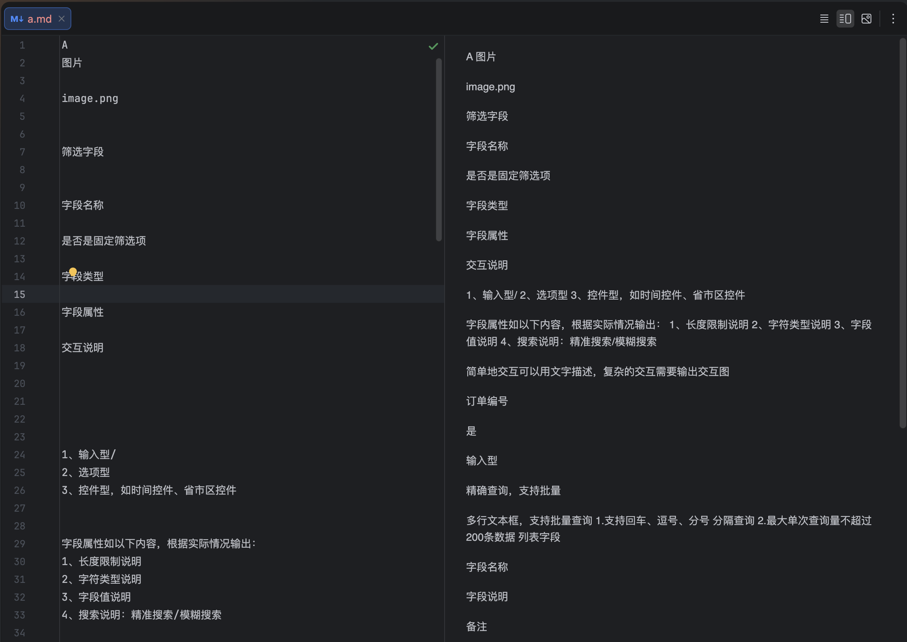
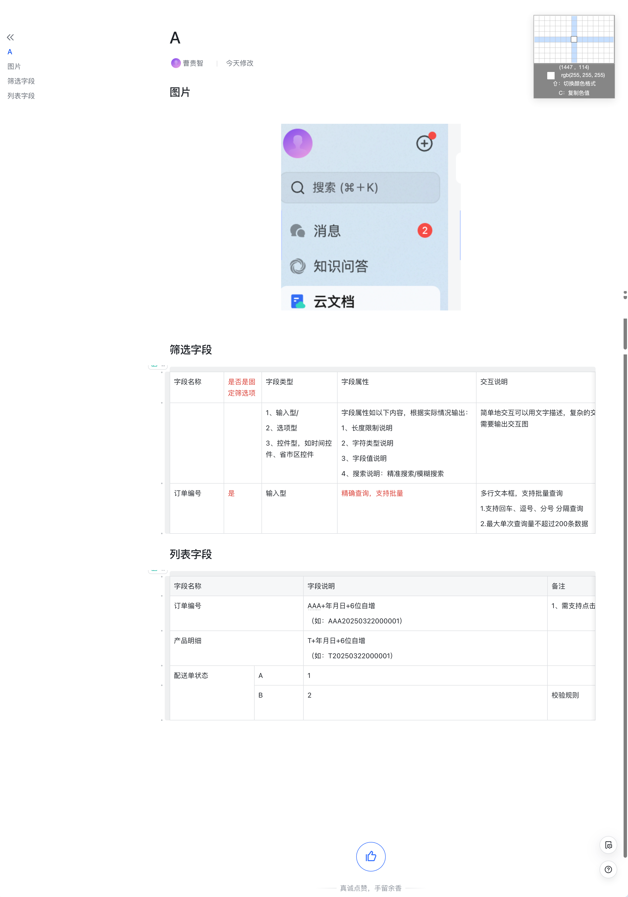
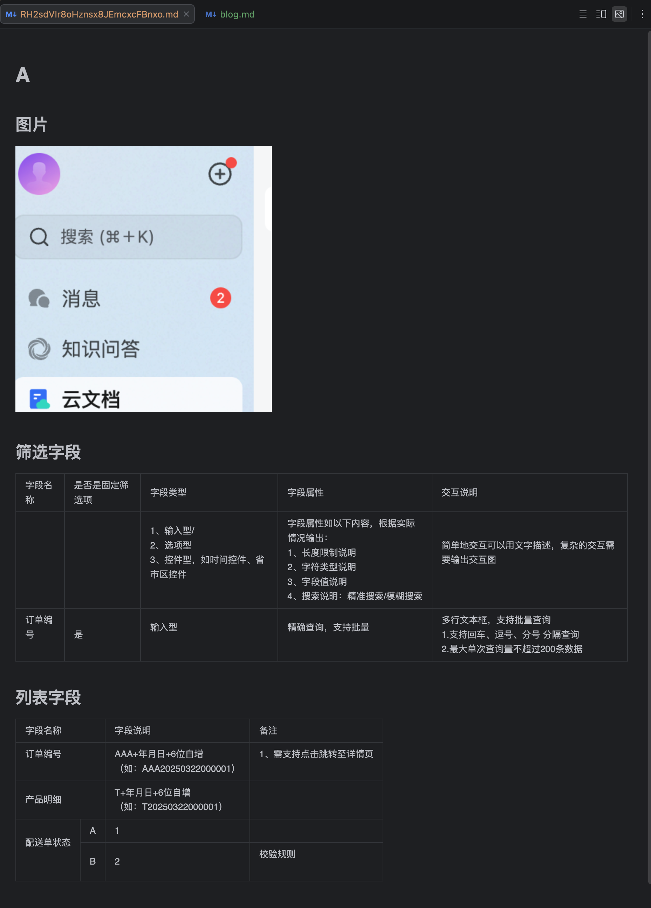
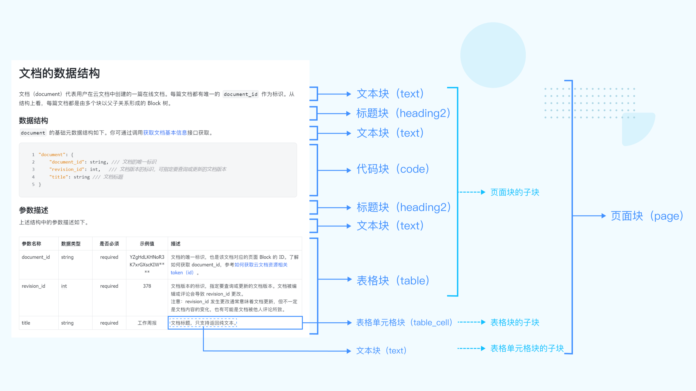

飞书官方的 lark-openapi-mcp MCP 在导出文档时会丢弃附件图片、文档层级、文档结构。通过 docx_v1_document_rawContent 获取纯文本内容。

这里提供一种基于 Skill + Cli 的方式解决此问题。Skill 的动态加载使用更友好，Cli 调用方式对应 Agent 友好，同时支持输出的文档包含附件图片、表格等内容。

- Github: https://github.com/Byte-n/larkDocx2md （好用 -> Star，不好用 -> issue ?）
- npm: https://www.npmjs.com/package/lark-docx2md

## 飞书官方 lark-openapi-mcp MCP

lark-openapi-mcp 是飞书官方提供的 MCP 工具。提供了读取文档的能力。

Agent 的使用步骤：

```text
# gpt-5.3-codex

› lark mcp 服务如何读取文档

• 用 Lark MCP 读取文档，常用是这 3 步：
  1. 先拿到文档真实 token
     如果是 wiki 链接（如 .../wiki/U7...），先调 mcp__lark__wiki_v2_space_getNode：
  - 入参：token=U7...
  - 返回里会有 obj_type 和 obj_token（真实文档 token）
  2. 按文档类型读取正文
  - 若 obj_type=docx，调用 mcp__lark__docx_v1_document_rawContent
  - 入参：document_id=<obj_token>
  - 返回纯文本正文（可直接落盘/处理）
  3. 写入本地文件
     把 raw_content 保存为 .md 或 .txt 即可。
  最小调用链就是：
  wiki_v2_space_getNode -> docx_v1_document_rawContent -> 写文件
  补充两点：
  - 你的应用/机器人必须对该文档有权限（否则会 403/无内容）。
  - useUAT（用户身份）通常比租户身份更容易读到个人/团队文档。
  如果你要，我可以直接给你一个“输入 wiki 链接 -> 自动输出本地 md”的固定脚本版本。
```

提示词："直接使用 lark mcp 服务读取 https://xxx.feishu.cn/wiki/xxx 文档的内容，并输出到 a.md 文件中。useUAT：false"

```text
# gpt-5.3-codex

› 直接使用 lark mcp 服务读取 https://xxx.feishu.cn/wiki/xxx 文档的内容，并输出到 a.md 文件中。useUAT：false

• Called lark.wiki_v2_space_getNode({"params":{"token":"xxxx"},"useUAT":false})
  └ { ...飞书接口响应 }
• Called lark.docx_v1_document_rawContent({"path":{"document_id":"RH2sdVIr8oHznsx8JEmcxcFBnxo"},"useUAT":false})
  └ {"content": "A\n图片\n\nimage.png\n\n\n筛选字段\n\n\n字段名称\n\n是否是固定筛选项\n\n字段类型\n\n字段属性\n\n交互说明\n\n\n\n\n\n1、输入型/\n2、选项型\n3、控件型，如时间控
        件、省市区控件\n\n\n字段属性如以下内容，根据实际情况输出：\n1、长度限制说明\n2、字符类型说明\n3、字段值说明\n4、搜索说明：精准搜索/模糊搜索\n\n简单地交互可以用文字描
        述，复杂的交互需要输出交互图\n\n\n订单编号\n\n\n是\n\n输入型\n\n\n精确查询，支持批量\n\n\n多行文本框，支持批量查询\n1.支持回车、逗号、分号 分隔查询\n2.最大单次查询量不
        超过200条数据\n列表字段\n\n\n字段名称\n\n\n\n字段说明\n\n备注\n\n订单编号\n\n\n\n\nAAA+年月日+6位自增\n（如：AAA20250322000001） \n\n1、需支持点击跳转至详情页\n\n\n产品
        明细\n\n\n\nT+年月日+6位自增\n（如：T20250322000001）\n\n\n\n配送单状态\n\n\nA\n\n1\n\n\n\n\n\nB\n\n2\n\n校验规则\n\n\n\n\n"}
─ Worked for 1m 21s ────────────────────────────────────────────────────────────────────────────────────────────────────────────────────────────────────────────────────────────
• 已完成，按你的要求直接走 Lark MCP（useUAT: false）读取该 Wiki 页面内容，并写入：
  - a.md
  文件位置：/Users/*/WebstormProjects/lark2md/a.md
  我也已本地确认文件存在并写入成功。
```

a.md (`raw_content`) 内容如下：



实际上文档的内容为：



lark-openapi-mcp 输出的文档内容是 `raw_content` 纯文本的内容。

## Skill + Cli：larkDocx2md

larkDocx2md 支持下载 https://xxx.feishu.cn/wiki/xxx 格式的链接为本地的 Markdown 文件。支持：

- 表格等格式转换
- 附件图片下载并链接到 Markdown 文件中
- 支持 `npx lark-docx2md` Cli 方式调用
- 提供方便 Agent 调用的 [larkDocx2md Skill](https://github.com/Byte-n/larkDocx2md/tree/main/skills/larkDocx2md)

## 使用

### Cli

```bash
npx -y lark-docx2md download <url> --app-id <APP_ID> --app-secret <APP_SECRET>
```

或先设置环境变量（命令行参数可省略）：

```bash
export LARK_DOCX2MD_APP_ID=<APP_ID>
export LARK_DOCX2MD_APP_SECRET=<APP_SECRET>
npx -y lark-docx2md download <url>
```

### Skill

安装 Skill：<跳过>

使用：

```text
› 读取 https://xxx.feishu.cn/wiki/xxx 文档内容
• 我会用 lark-docx2md 技能先把这个 Feishu Wiki 链接拉取为本地 Markdown，然后直接读取并返回文档内容。先检查技能说明并执行下载命令。
• Explored
  └ Read SKILL.md
────────────────────────────────────────────────────────────────────────────────────────────────────────────────────────────────────────────────────────────────────────────────
• 技能说明已确认。我将按规范把链接转换到 larkDocx2mdOutput/，然后读取生成的 Markdown 内容。
• Ran npm_config_cache="/tmp/.npm-cache" npx -y lark-docx2md download --agent --output "/Users/xxx/WebstormProjects/lark2md/larkDocx2mdOutput/"
  │ "https://xxx.feishu.cn/wiki/xxx"
  └ Read and process the following Markdown file: /Users/xxx/WebstormProjects/lark2md/larkDocx2mdOutput/xxx.md
────────────────────────────────────────────────────────────────────────────────────────────────────────────────────────────────────────────────────────────────────────────────
• 拉取成功，正在读取生成的 Markdown 文件内容。
• Explored
  └ Read xxx.md
────────────────────────────────────────────────────────────────────────────────────────────────────────────────────────────────────────────────────────────────────────────────
• 已读取到该文档，larkDocx2mdOutput/xxx.md

```

larkDocx2mdOutput/xxx.md 文档内容：

```text
# A

## 图片


## 筛选字段

<table>
<tr>
<td>字段名称<br/></td><td>是否是固定筛选项<br/></td><td>字段类型<br/></td><td>字段属性<br/></td><td>交互说明<br/></td></tr>
<tr>
<td><br/></td><td><br/></td><td>1、输入型/<br/>2、选项型<br/>3、控件型，如时间控件、省市区控件<br/><br/></td><td>字段属性如以下内容，根据实际情况输出：<br/>1、长度限制说明<br/>2、字符类型说明<br/>3、字段值说明<br/>4、搜索说明：精准搜索/模糊搜索<br/></td><td>简单地交互可以用文字描述，复杂的交互需要输出交互图<br/><br/></td></tr>
<tr>
<td>订单编号<br/><br/></td><td>是<br/></td><td>输入型<br/><br/></td><td>精确查询，支持批量<br/><br/></td><td>多行文本框，支持批量查询<br/>1.支持回车、逗号、分号 分隔查询<br/>2.最大单次查询量不超过200条数据<br/></td></tr>
</table>

## 列表字段

<table>
<tr>
<td colspan="2">字段名称<br/></td><td>字段说明<br/></td><td>备注<br/></td></tr>
<tr>
<td colspan="2">订单编号<br/><br/></td><td>AAA+年月日+6位自增<br/>（如：AAA20250322000001） <br/></td><td>1、需支持点击跳转至详情页<br/><br/></td></tr>
<tr>
<td colspan="2">产品明细<br/></td><td>T+年月日+6位自增<br/>（如：T20250322000001）<br/></td><td><br/></td></tr>
<tr>
<td rowspan="2">配送单状态<br/><br/></td><td>A<br/></td><td>1<br/></td><td><br/></td></tr>
<tr>
<td>B<br/></td><td>2<br/></td><td>校验规则<br/><br/></td></tr>
</table>

## 

## 


```

Markdown 效果，图片、表格、表格夸行、夸列都正常展示。


## 实现原理

larkDocx2md 代码仓库：https://github.com/Byte-n/larkDocx2md

**参考资料；**

- [飞书官方文档](https://open.feishu.cn/document/server-docs/docs/docs/docx-v1/docx-overview#e18a49a1)
- [社区工具 feishu2md](https://github.com/Wsine/feishu2md)

**飞书的文档构成如图：**


每个块，都有对应的存储结构，只需要针对特定的结构转换为 Markdown 对应的结构（这里可能存在递归）

飞书提供的 API 有：

- 获取文档所有块
- 获取文档基本信息
- 获取文档纯文本内容
- 获取所有子块
- 获取块
- ...

**实现思路：**

1. 接收飞书文档链接，识别链接类型。

2. 输入是 Wiki 链接，先把 Wiki 节点解析为真实文档 Token

3. 先获取文档元信息（标题、标识等）、再分页拉取文档块（block）数据，直到拿到完整块树。

4. 结构化转换为 Markdown
    - 以块树为基础递归遍历，按块类型映射为 Markdown/HTML。
    - 常规文本块（标题、段落、列表、引用、代码块、任务项等）直接转换为对应语法。
    - 复杂表格（含合并单元格）使用 HTML table 表达，保证结构不丢失。
    - 图片先保留资源标识占位，便于后续统一下载与替换。

5. 资源下载与链接回填
    - 批量下载图片资源到本地静态目录。
    - 将文档中的图片占位链接替换为本地相对路径链接，形成可离线查看的 Markdown。

6. 最终输出
    - 生成最终 Markdown 文件。
    - 在 Agent 场景下补充输出可直接读取的目标文件路径，便于后续自动处理。

调用的 API

1. Wiki 节点查询 API
    - 用于把 Wiki 链接转换为真实文档对象，获取后续读取所需的文档 Token。

2. 文档信息 API
    - 用于获取文档基础信息（如标题与文档 ID），作为解析入口与输出命名参考。

3. 文档块列表 API（分页）
    - 用于拉取文档的完整块结构数据，是 Markdown 转换的核心输入。

4. 媒体下载 API
    - 用于下载文档中的图片资源到本地，配合 Markdown 链接改写实现本地化引用。

5. 错误码与重试/中断策略
    - 所有 API 调用统一校验返回状态，遇到失败即时中断并报错，避免生成不完整内容。

**可优化**

Markdown 的文本内容生成过程都是大量字符串操作，是否可以在转换过程中不以字符串的形式存储，而是以文档树的结构存储。

- 每个部分的转换只在特定的子树上操作。
- 最终输出就是深度优先遍历输出字符串内容即可。
- 对应部分因为 API 频率限制导致失败，方便重试重写部分数据。
- 更好的扩展性


## 其他问题

- 为什么表格转换为 HTML 的 Table？

大部分 Markdown 渲染器支持渲染部分 HTML 标签，这里包含 Table。其次 Markdown 的 `|---|` 表格方式无法实现夸列、夸行，而 HTML Table 可以。当然这里也可以用Markdown 的 `|---|` + 重复列、行值来解决。
