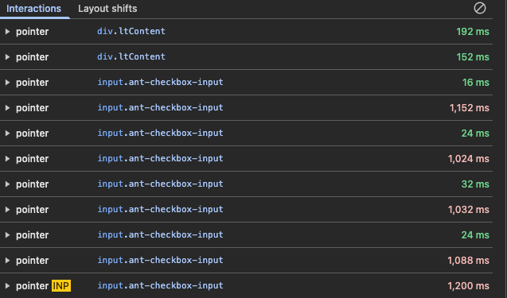
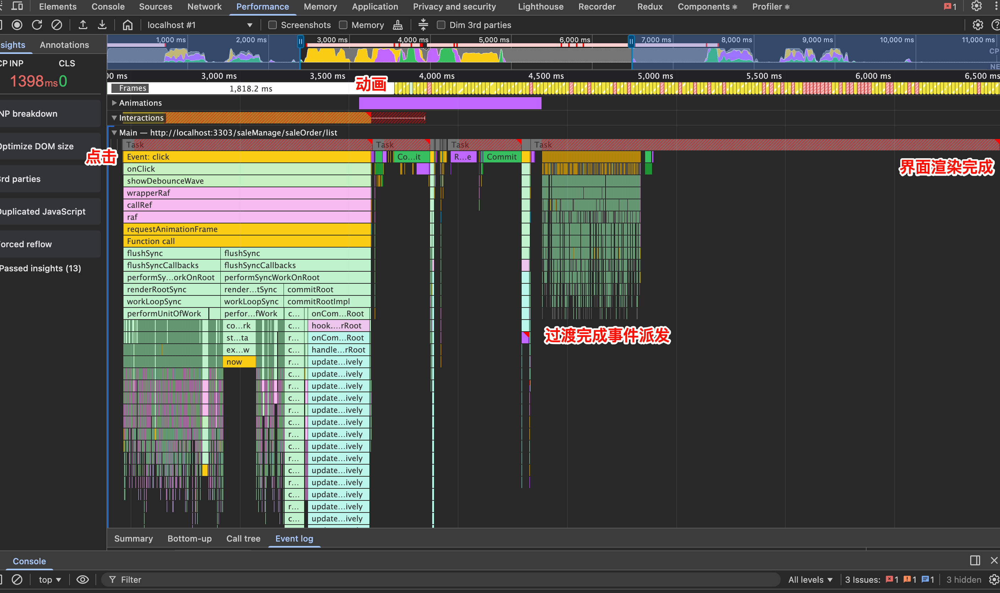
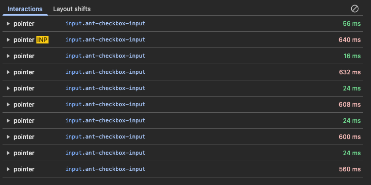
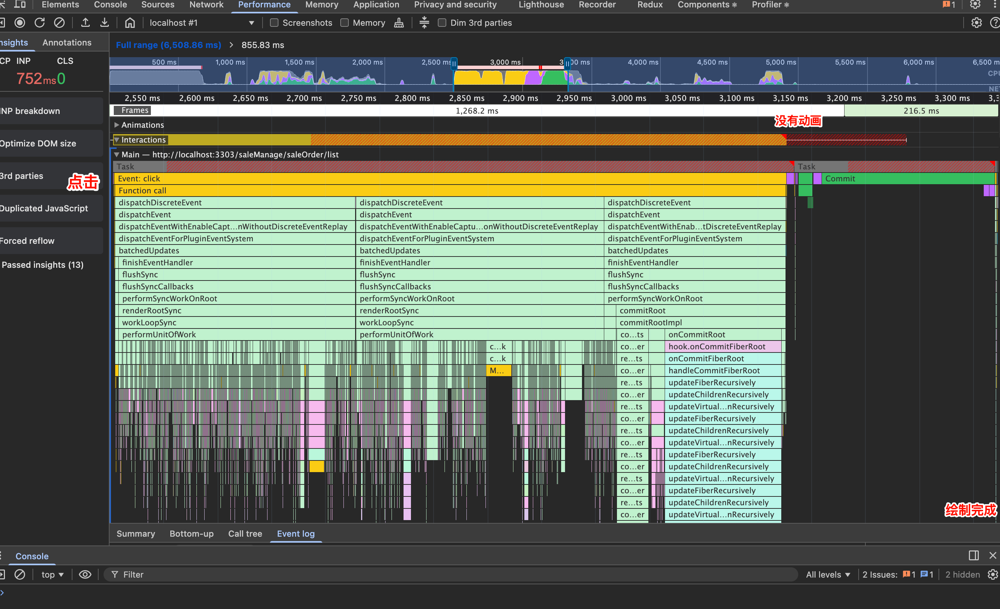

## 背景
在OMS项目中有一个展示销售订单的表格（基于 Ant design Table），表格有36列，包含基础的字符、自定义组件、操作列等。在表格每页展示100行数据的时候，表格也能较快的完成渲染。但在点击表格全选按钮（或取消全选）时会非常卡顿，整个界面都会进入短暂的不可交互状态。

## 问题分析

借助浏览器的控制台工具中的性能板块，可以查看、录制一段时间内的代码运行、渲染等耗时时间。其中 [INP](https://web.dev/articles/inp?hl=zh-cn) 指标在每一次点击时都会自动记录。

INP指标 > 1s
> 良好的 INP 值为 200 毫秒或更短



从下面火焰图可以看出，此点击开始到界面可再次交互时间 > 4s。
- 处理点击，React调度，dom 变更 1.14s
- 过度动画本身 0.8s 左右
- 过度完成事件派发（React的事件系统）近 1s
在 Frames 一栏中，在点击事件处理完成后，后续渲染的全是黄色、红色的帧。
- 绿色 ：流畅帧。表示该帧在目标时间内（通常是 60 FPS，约 16.6ms 内）完成渲染，用户体验流畅。
- 红色 ：丢帧。表示该帧耗时过长，导致严重的掉帧或卡顿，通常对应低于 30 FPS 的情况。
- 黄色 ：部分呈现帧。这表示虽然主线程工作延迟，但合成器线程仍生成了视觉更新（例如滚动或某些动画），这类帧未完全阻塞但性能欠佳。


主要原因：Ant design Table 的多选 Checkbox、td 的状态变化都有丰富的动画、过渡样式。
次要原因：表格渲染的内容非常多：36 列 100 行、且部分列为自定义列

## 优化方案
针对主要原因中的样式进行优化，移除多选相关的动画、过渡效果：
```less
.table-animation-none.ant-table-wrapper {
  .ant-table-container {

    .ant-table-selection-column {

      .ant-checkbox-checked .ant-checkbox-inner {
        animation: none;
        transition: none;

        &:after {
          animation: none;
          transition: none;
        }
      }
    }

    .ant-table-tbody > tr > td {
      animation: none;
      transition: none;

      &::after {
        animation: none;
        transition: none;
      }
    }
  }
}
```


移除后的效果：
首先是 INP：0.6s 左右，相比之前的 >1s，有很大的提升。 


此下面火焰图看，时间缩短到了 1s 内。约 0.8s
- 处理点击，React调度，dom 变更 0.5 s，相比之前少了 wave 相关的内容
- 过度动画无
- 过度完成事件派发无
另外可以看见的是 Frames 这一栏 只有白色、绿色的帧，相比之前有黄色（部分帧）、红色（丢弃帧）的。


## 其他方案
- 仍然使用 EnhancedTable，开启虚拟表格模式。但在滚动时会出现空白区域，且未提供相关的选项、接口来控制预渲染行。滚动时，体验不佳，且 ant v5 本身 虚拟表格写的很烂，不知道 v6 中是否有改善。

- 使用一些虚拟化的表格渲染方案，主要有基于 Dom 与基于 Canvas 的两种方案，后者可以实现极致的性能，但上手难度更高。使用第三方的 Table 组件。需要适配现有的样式、兼容现有的调用方式。
  - 基于 Dom 的 Virtual Table
    - react-window 结合 react-resize ，需要手动模拟实现虚拟表格
    - https://github.com/yangfei4913438/react-window-table
    - https://rv-grid.com/guide/react
  - 基于 Canvas 的 Virtual Table，优点就是可以实现极致的性能，但无法搜索表格中的文本，极致的性能需要结合canvas实现。
