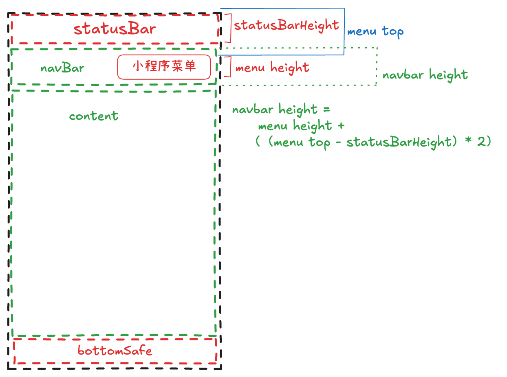

## 背景

`navBarHeight`使用的是`statusBarHeight || 44` 像素，在安卓的部分机型上，与小程序菜单按钮上下间距不一致或与菜单按钮重叠。在IOS上则一切正常。

- 动态计算合适的 navBar高度



## 代码

```tsx
import Taro from '@tarojs/taro'
import { useMemo } from 'react'

export default function useSystemInfo() {
  const menuInfo = Taro.getMenuButtonBoundingClientRect()
  const { systemInfo, navBarHeight, safeHeight, bottomSafeHeight, statusBarHeight, windowInfo } = useMemo(() => {
    // 获取的数值单位是px
    const windowInfo = wx.getWindowInfo(); // 用
    const menuButtonInfo = wx.getMenuButtonBoundingClientRect();
    let statusBarHeight = windowInfo.statusBarHeight;
    let navBarHeight = menuButtonInfo.height + (menuButtonInfo.top - statusBarHeight) * 2;
    let safeHeight = windowInfo.safeArea.height;
    let bottomSafeHeight = windowInfo.screenHeight - windowInfo.safeArea.height - statusBarHeight;

    return {
      navBarHeight, safeHeight, bottomSafeHeight,
      statusBarHeight,
      systemInfo: Taro.getSystemInfoSync(), windowInfo
    }
  }, [])

  return {
    menuInfo,
    systemInfo, windowInfo,
    navBarHeight, safeHeight, bottomSafeHeight, statusBarHeight
  }
}

```

## 使用

组件

```tsx
import useSystemInfo from '@/modules/common/hooks/useSystemInfo'
import { View } from '@tarojs/components'
import Taro from '@tarojs/taro'
import classNames from 'classnames'
import { ReactNode, useEffect, useState } from 'react'
import './index.scss'

export interface NavBarProps {
  title?: ReactNode
  left?: ReactNode
  onBackClick?: () => void
  fixed?: boolean
  placeholder?: boolean
  background?: string
}

export default function NavBar({
  background = '#fff',
  title,
  fixed = true,
  placeholder = true,
  left = <View className="sonic-icon sonic-icon-right-arrow"></View>,
  onBackClick = () => {
    Taro.navigateBack()
  },
}: NavBarProps) {
  const { navBarHeight, statusBarHeight } = useSystemInfo()
  const [useBackground, setUseBackground] = useState(false)
  useEffect(() => {
    if (!fixed || !placeholder || Number.isNaN(navBarHeight)) {
      return
    }
    const observe = Taro.createIntersectionObserver(this, {
      thresholds: [0],
      observeAll: false,
    })
    observe
      .relativeToViewport({
        top: 0,
      })
      .observe('.observe-view', (res) => {
        setUseBackground(res.intersectionRatio < 1)
      })
    return () => {
      observe.disconnect()
    }
  }, [fixed, placeholder, navBarHeight])
  return (
    <>
      <View
        style={{
          backgroundColor: background
            ? background
            : useBackground
              ? background
              : 'transparent',
        }}
        className={classNames('nav-bar-container', {
          'fixed-top': fixed,
        })}
      >
        <View style={{ height: statusBarHeight }}></View>
        <View
          className="nav-bar flex items-center cff fz36"
          style={{
            height: (navBarHeight),
          }}
        >
          {left && (
            <View onClick={onBackClick} className="nav-bar-back px-25 py-20">
              {left}
            </View>
          )}
          <View className="nav-bar-title text-overflow tx-c f36 c00 ">
            {title}
          </View>
        </View>
      </View>
      {placeholder && (
        <View className="placeholder">
          <View style={{ height: statusBarHeight }} />
          <View style={{ height: navBarHeight }} />
        </View>
      )}
      <View className="observe-view" style={{ height: 1 }}></View>
    </>
  )
}

```

样式 index.scss

```scss
.nav-bar-container {
  width: 100vw;
  transition: 0.5s background-color;
  .sonic-icon-right-arrow {
    transform: rotate(180deg);
  }

  &.fixed-top {
    position: fixed;
    left: 0;
    top: 0;
    right: 0;
    z-index: 100;
  }
}
.nav-bar-back {
  position: relative;
  z-index: 9;
  color: #000;
}

.nav-bar-title {
  position: absolute;
  width: 100%;
}

```
