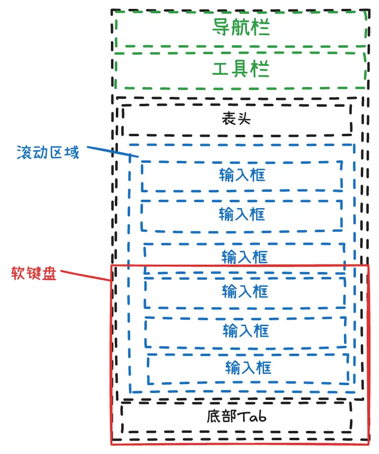

## 背景

底部的蓝色的输入框获取焦点时，软键盘弹出，会将整个界面上推，导致绿色的部分不可见。期望绿色的部分一直看见。

## 解决

监听软键盘的弹出与收起，动态修改蓝色滚动区域的高度，并判断当前获取焦点的输入框是否在可见区域内，若不在则，滚动到当前输入框的位置。



通过`onKeyboardHeightChange` 事件监听软键盘的出现（高度>0)与隐藏（高度===0）。
根据`e.detail.height` 高度，动态适配界面。

## 实现

```tsx
// 当前键盘的高度，界面中根据此状态，调整界面布局高度等
const [keyboardHeight, setKeyboardHeight] = useState<number>(0)
// 传递给 scrool-view 的 scrollTop。也可以直接获取 scrool-view 的实例，调用scrollTop函数
const [scrollTop, setScrollTop] = useState<number>(0)
const keyboardEvent = useCallback((height: number, index: number) => {
  const eventHeight = height
  if (eventHeight === 0) {
    return;
  }
  Taro.createSelectorQuery()
	  // 底部的 tabbar
    .select(`#bottom-bar-wrapper`).boundingClientRect()
    // 滚动区域
    .select(`#scroll-wrapper-inner`).boundingClientRect()
    .select(`#scroll-wrapper-inner`).scrollOffset()
    // 当前输入框
    .select(`#row-${index}`).boundingClientRect()
    .exec((res) => {
      const [bottomBar, container, offset, row] = res as any[]
      const nextKeyboardHeight = eventHeight - bottomBar.height
      if (nextKeyboardHeight >= 0 && keyboardHeight !== nextKeyboardHeight) {
        setKeyboardHeight(nextKeyboardHeight)
      }

      if (!container || !row) {
        return
      }

      const visibleTop = container.top
      const visibleBottom = container.bottom - eventHeight - bottomBar.height
      const currentScrollTop = offset?.scrollTop || 0

      // 已完全可见则不滚动
      if (row.top >= visibleTop && row.bottom <= visibleBottom) {
        return
      }

      let delta = 0
      if (row.bottom > visibleBottom) {
        // 需要向下滚动
        delta = row.bottom - visibleBottom + 8
      } else if (row.top < visibleTop) {
        // 需要向上滚动
        delta = row.top - visibleTop - 8
      }

      if (delta !== 0) {
        const nextTop = Math.max(0, currentScrollTop + delta)
        setScrollTop(nextTop)
      }
    })

}, [])

// 注意：若导致键盘收起的操作不是来自输入框，则不会触发输入框的onKeyboardHeightChange 。所以需要监听全局的会调兜底
useEffect(() => {
  const func = ({ height }) => {
    if (height === 0) {
      setKeyboardHeight(0);
    }
  }
  Taro.onKeyboardHeightChange(func)
  return () => {
    Taro.offKeyboardHeightChange(func);
  }
}, [])
```

##  `input`中的`placeholder` 不跟随滚动的问题解决：

设置 `mixedRenderComponents`

```tsx
  // app.config.ts
  window: {
    // 有可能导致 scroll view 中的 input 的 blur 事件触发多次。不推荐。
    mixedRenderComponents: ['input'], 
  },
```

或者移除 index.config 中的 `disableScroll: true`
