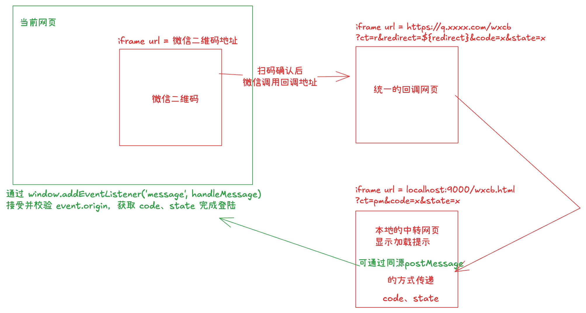

## 微信扫描登录
[微信官方文档](https://developers.weixin.qq.com/doc/oplatform/Website_App/WeChat_Login/Wechat_Login.html)

在网页中嵌入微信的登录二维码，会在`login_container` 下嵌入一个`iframe` ，`iframe` 的地址其实就是 “https://open.weixin.qq.com/connect/qrconnect?`appid`=APPID&`redirect_uri`=REDIRECT_URI&`response_type`=code&`scope`=SCOPE&`state`=STATE#wechat_redirect” ，URL中对应的参数就是`WxLogin`的构造参数。

```jsx
var obj = new WxLogin({
  self_redirect:true,
  id:"login_container",
  appid: "",
  scope: "",
  redirect_uri: "",
  state: "",
  style: "",
  href: "",
  onReady: function(isReady){
    console.log(isReady);
  }
});
```

在扫码完成登录后，该`iframe`就会重定向到`redirect_uri` ，并在`url`的参数中拼接`code`参数。
`redirect_uri` 是微信登录成功界面。此页面可以获取到`code`，在页面加载后，读取`code` 通过`window.postMessage` ，将`code`传递给上一级网页。

## 统一的重定向地址
扩展实现一个支持多种方式回传code与state的网页：

```tsx
<!DOCTYPE html>
<html lang="en">

<head>
    <meta http-equiv="Content-Type" content="text/html; charset=UTF-8">
    <meta http-equiv="X-UA-Compatible" content="IE=edge">
    <meta name="viewport" content="width=device-width, initial-scale=1.0">
    <title>Redirect...</title>
    
</head>

<body>
<div class="container">
    <div class="loading">
        加载中...
    </div>
    <script>
        var urlParams = new URLSearchParams(window.location.search);
        var code = urlParams.get('code')
        var state = urlParams.get('state')
        var key = urlParams.get('key')
        var redirect = urlParams.get('redirect')
        /*
        回传 JSON.stringfy({ code, state }) 的方式：
        pm: parent.postMessage
        ss: 直接将值设置到 sessionStorage.setItem(key, ... )
        r: 重定向：调整到 redirect 的地址，拼接参数 code与state，redirect需要解码
        */
        var ct = urlParams.get('ct');

        function main() {
            // 根据 ct 参数值执行不同的操作
            const data = {code, state};
            const dataStr = JSON.stringify(data);

            switch (ct) {
                case 'pm':
                    // 使用 parent.postMessage 回传数据
                    if (window.parent && window.parent !== window) {
                        let targetOrigin;
                        try {
                            targetOrigin = window.parent.origin;
                        } catch (error) {
                            console.log('读取 window.parent.origin 失败，使用默认 targetOrigin:', error);
                            targetOrigin = location.origin
                        }
                        window.parent.postMessage({action: 'WECHAT_LOGIN_SUCCESS', data}, targetOrigin);
                    }
                    break;
                case 'ss':
                    // 使用 sessionStorage.setItem 回传数据
                    if (key) {
                        sessionStorage.setItem(key, dataStr);
                    }
                    break;
                case 'r':
                    // 重定向：调整到 redirect 的地址，拼接参数 code 与 state
                    if (redirect) {
                        const decodedRedirect = decodeURIComponent(redirect);
                        const redirectUrl = new URL(decodedRedirect);
                        redirectUrl.searchParams.set('code', code);
                        redirectUrl.searchParams.set('state', state);
                        window.location.href = redirectUrl.toString();
                    }
                    break;
                default:
                    // 如果未指定或指定错误的 ct 值，默认使用 postMessage
                    if (window.parent && window.parent !== window) {
                        let targetOrigin = '*';
                        try {
                            targetOrigin = window.parent.origin;
                        } catch (error) {
                            console.log('读取 window.parent.origin 失败，使用默认 targetOrigin:', error);
                        }
                        window.parent.postMessage(data, targetOrigin);
                    }
                    break;
            }
        }

        main();
    </script>
</div>
</body>
</html>
```

## 例如使用：

预期使用**同源的postMessage**来传递消息：
本地、开发、测试、线上域名都不一样。而微信的验证回调只能填写一个地址。
所以预期的方案是由这个唯一的地址根据参数进行不同的操作，将参数回传。
假设验证回调为：`https://q.xxxx.com/wxcb?ct=r&redirect=${redirect}` 
本地是`localhost:9000` ，用户扫描登陆后会触发回调`https://q.xxxx.com/wxcb?ct=r&redirect=${redirect}&code=x&state=x` ，将 `redirect` 调整为本地的`localhost:9000/wxcb.html?ct=pm` ，就会再跳转到`localhost:9000/wxcb.html?ct=pm&code=x&state=x`再由此网页通过同源postMessage将code传递给当前网页去完成登陆。这样当前网页就不用刷新了，几个步骤的网页都在当前网页的iframe中刷新

```tsx
  const initWechatLogin = useCallback(() => {
    try {
      const redirect = encodeURIComponent(
        `${location.protocol}//${location.host}/wxcb.html?ct=pm`
      )
      // 创建微信登录实例
      new window.WxLogin({
        id: 'wechat-login-container',
        self_redirect: true,
        appid: APP_ID,
        scope: 'snsapi_login',
        redirect_uri: encodeURIComponent(
          `https://q.xxxx.com/wxcb?ct=r&redirect=${redirect}`
        ),
        state: 'lite',
        style: '', 
      })
    } catch (error) {
      onError?.(error)
    }
  }, [])
```


